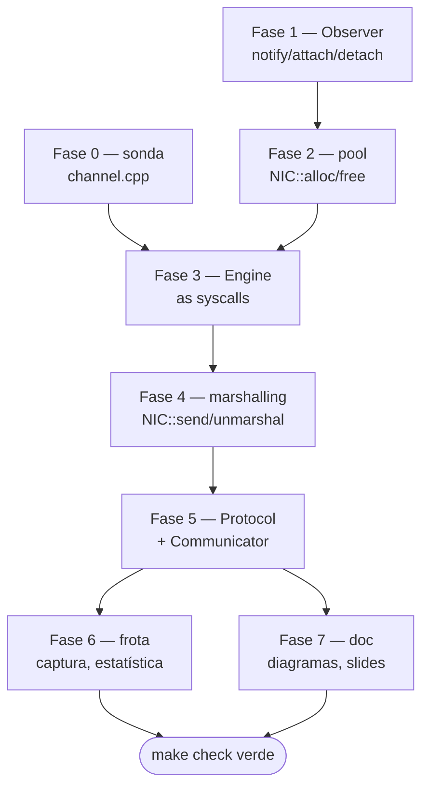

# Roadmap de implementação — libvcomm Etapa 1

Documento de trabalho, não artefato de banca (o que a banca lê é `doc/`).
Escrito em 22/08/2026.

---

## A restrição que define a ordem

Artur viaja 26–31/08 e o Fröhlich autorizou antecipar. Logo a apresentação é
**segunda 24 ou terça 25** — dois dias, sendo hoje sábado — **ou** depois de 31/08,
o que dá dez dias. Enquanto a data não estiver confirmada, o roadmap assume a
hipótese apertada, porque ela é a única que pode dar errado.

Consequência prática: **o checklist de aceitação não é só C++.** `make` tem que
rodar a avaliação inteira, a latência tem que sair automaticamente, e diagramas e
slides têm que estar em `doc/`. Quem gasta os dois dias inteiros na Engine chega na
banca com uma biblioteca bonita e sem apresentação. As fases 6 e 7 têm bloco
reservado desde já.

**A linha que separa "tenho o que mostrar" de "não tenho" está no fim da Fase 5.**

---

## Dependências

A Fase 0 é paralela às Fases 1–2: se travar no Observer, vá para a sonda e volte.

---

## Fase 0 — Sonda de raw socket · ~2 h · descartável

Termine o `src/channel.cpp` que você já começou: um programa só, sem biblioteca
nenhuma, que manda de uma VM e recebe na outra.

- **Faça:** `socket` → `if_nametoindex` → `SIOCGIFHWADDR` → `bind` → `sendto` / `recvfrom`.
  Papel por `argv[1]` (`send` ou `recv`).
- **Verificação:** VM 1 manda, VM 2 imprime. Duas VMs, `SO2_MCAST` do grupo.
- **Por que antes da Engine:** são as mesmas cinco syscalls, sem classe, sem sinal,
  sem pool. Você aprende o mecanismo isolado e depois **porta** para a Engine, em vez
  de depurar syscall e arquitetura ao mesmo tempo. É a única fase cujo código vai
  para o lixo — e ainda assim vale o tempo.
- **Armadilha:** `htons()` no terceiro argumento do `socket()`. Sem ele o kernel
  filtra por `0xB588` e você não recebe nada, sem erro nenhum.

> Se você já provou isso para si mesmo em outra sessão, pule direto para a Fase 1.

---

## Fase 1 — Observer · ~1 h · **comece aqui**

`Conditionally_Data_Observed::attach` / `detach` / `notify`, em `include/observer.h`.

- **Verificação:** `make test-stack` — hoje 15 checks e 7 falhas. Esta fase deixa
  verdes as 4 falhas da seção 1.
- **Contrato que importa:** `notify()` devolve `false` quando ninguém escutava aquela
  condição. Esse `false` é o que diz à NIC "pode liberar o buffer". Se você devolver
  `true` sempre, o vazamento só aparece depois de 32 mensagens — na demo.
- **Por que primeiro:** é a fase mais barata do projeto e desbloqueia NIC e Protocol
  ao mesmo tempo. Melhor relação destravamento/hora do roadmap inteiro.

---

## Fase 2 — Pool de buffers · ~1–2 h

`NIC::alloc` e `NIC::free`, em `include/nic.h`.

- **Verificação:** as 3 falhas da seção 3 do `test-stack` ficam verdes e mais 2 checks
  que hoje nem chegam a rodar aparecem (o bloco dentro do `if(first)`). Você deve
  terminar com **17 checks**, todos verdes.
- **Decisão sua:** `alloc()` preenche cabeçalho de **envio**. A recepção precisa de um
  buffer sem cabeçalho montado — um `alloc_receive()` separado, ou um parâmetro? Decida
  agora e escreva em `doc/decisoes.md`; a Fase 3 depende disso.
- **Armadilha:** o teste de exaustão existe de propósito. Pool esgotado devolvendo `0`
  é comportamento **correto**, não erro fatal.

---

## Fase 3 — Engine · ~3–4 h · **a fase de maior risco**

`src/raw_socket_engine.cpp`: passos 3 a 5 (armar o sinal, `drain`, `engine_stop`);
mais `NIC::handle` em `nic.h`. O construtor e o `engine_send` já estão prontos.

- **A recepção é por SINAL, não por thread** — exigência do enunciado, ver
  `doc/decisoes.md` §2.1. Os passos comentados no `.cpp` seguem essa ordem.
- **Verificação intermediária 1:** o construtor imprime o MAC lido; confira contra
  `ip -br link` **dentro da VM** (no host o `socket(AF_PACKET)` falha com `EPERM`).
  Não avance sem isso bater.
- **Verificação intermediária 2:** um `write(2)` no handler prova que ele dispara,
  antes de você escrever uma linha de `drain()`.
- **Verificação da fase:** VM 1 manda pela `NIC`, VM 2 recebe e o `handle()` imprime.
- **A restrição que manda nesta fase:** tudo alcançável a partir de `handle()` roda em
  contexto de sinal. Nada de `printf`/stdio, `malloc`/`new`, `std::mutex`
  (`man 7 signal-safety`). O `list.h` já foi reescrito lock-free por causa disso; o seu
  `NIC::handle` tem que respeitar o mesmo limite.
- **Ganho:** a pergunta 3 do guia ("how will a blocked receiver terminate cleanly")
  deixa de existir — não há receptor bloqueado. Desarmar é tirar o `O_ASYNC`. Diga isso
  na apresentação.
- **Armadilha nova:** um `Ethernet::Frame` local dentro do handler são 1514 bytes na
  pilha da thread interrompida, que não é você quem escolheu.
- **Armadilha medida nesta bancada:** o `virtio-net` do QEMU **não** faz padding para 60
  bytes. `tamanho = recebido - 14` funciona aqui e quebra em hardware real e na Etapa 2.
  Se quiser tamanho correto em qualquer meio, ele tem que viajar num campo do
  `Protocol::Header` — decisão que a Fase 5 vai cobrar.

---

## Fase 4 — Marshalling · ~1–2 h

`NIC::send(Address, prot, data, size)`, `NIC::send(Buffer*)`, `NIC::unmarshal`.

- **Verificação:** escreva o teste de ida-e-volta que deixei como TODO no item 4 do
  `tests/test_stack.cpp`. Monta com `alloc()`, passa por `unmarshal()`, confere que
  `src`, `dst` e os bytes voltam idênticos.
- **Por que vale o teste:** é ele que pega erro de byte order e de offset de cabeçalho
  **no host, em segundos**, em vez de com tshark às duas da manhã.

---

## Fase 5 — Protocol + Communicator · ~2–3 h · **a linha da demo**

`include/protocol.h` e `include/communicator.h`.

- **Verificação:** cinco VMs. VM 1 emite, VMs 2–5 imprimem `RESULT ... OK`. Isso fecha
  o item "quatro receptores provam a recepção de um emissor" do checklist.
- **Armadilha do PDF:** `Communicator::receive()` — o enunciado passa `message->size()`
  como capacidade. Numa mensagem recém-construída isso é **0** e você recebe zero bytes
  para sempre, sem erro. Capacidade na entrada, tamanho recebido na saída, campos
  diferentes.
- **A partir daqui você tem o que mostrar.** Se o tempo acabar depois desta fase, veja
  "Corte de emergência".

---

## Fase 6 — Frota, captura, estatística · ~3–4 h

`scripts/run-fleet.sh`, `capture.sh`, `analyze-capture.sh`, `install-initramfs.sh`,
e trocar o `.DEFAULT_GOAL` do Makefile para `check`.

- **Verificação:** `make check` roda inteiro **e falha** quando um receptor perde frame,
  quando uma VM estoura o timeout, ou quando a captura sai vazia. Teste que só imprime
  aviso não é avaliável — está escrito no guia.
- **Antes de medir qualquer coisa:** `ip route get 239.10.10.10`. Nesta máquina responde
  `dev wlp0s20f3` — o barramento sai pela WiFi. Capturar em `lo` devolve captura vazia.
  `sudo ip route add 239.10.10.0/24 dev lo` prende o barramento à máquina.
- **Rótulo honesto:** se você mediu request→response, é round-trip. E diga que a bancada
  roda em TCG, sem `/dev/kvm` — o número é dominado por ruído de emulação. Reportar isso
  é mais forte do que um número bonito sem contexto.

---

## Fase 7 — Documentação e slides · ~2–3 h · **não é opcional**

- Diagramas em `doc/`: topologia da frota, camadas, e a sequência de uma mensagem do
  `send()` até a thread da aplicação acordar, marcando onde começa e termina o contexto
  de sinal. O enunciado exige.
- `doc/decisoes.md` já tem os nove desvios da API do PDF. Falta preencher as pendências
  do §4 e conferir que cada decisão que você tomou nas Fases 2, 3 e 5 está lá.
- Slides em `doc/`, com a avaliação de desempenho.
- O commit avaliado tem que estar na `main`.

---

## Plano do fim de semana (hipótese: apresentação segunda ou terça)

| Quando | O quê |
|---|---|
| sáb 22, tarde/noite | Fases 0, 1, 2 — sonda funcionando e `test-stack` verde |
| dom 23, manhã | Fase 3 — Engine; duas VMs conversando pela `NIC` |
| dom 23, tarde | Fases 4 e 5 — cinco VMs, quatro receptores provando |
| dom 23, noite | Fase 6 — `make check` |
| seg 24, manhã | Fase 7 — diagramas e slides |

Se domingo à noite a Fase 5 não estiver de pé, **pare de codar e vá para a Fase 7.**
Uma demo parcial bem explicada vale mais que uma completa sem slides.

---

## Corte de emergência

Se o tempo apertar, corte **nesta ordem** — do menos doloroso ao mais:

1. **`NIC::receive()` síncrono.** É redundante com o par `handle()`/`notify()` nesta
   arquitetura. Deixe devolvendo `-1` e **explique a decisão em `doc/`**. Método morto
   documentado é melhor que método morto escondido.
2. **`NIC::address(Address)` setter.** A Etapa 1 usa o MAC real de `eth0` e não deixa
   ninguém trocar. Mesma regra: documente.
3. **Percentil na estatística.** Entregue count, mean, min e max; o guia diz
   "preferencialmente" para o percentil.
4. **Fork dos componentes.** Um processo por VM ainda modela cinco veículos e cumpre a
   parte do checklist que fala de VMs. A modelagem de componentes como processos POSIX é
   requisito do enunciado, então isto é dívida **declarada** na apresentação, não
   esquecida — e é exatamente por onde a Etapa 2 começa.

O que **não** se corta, porque é item explícito do checklist de aceitação: broadcast como
destino, EtherType dedicado, cinco VMs, quatro receptores provando recepção, `make` que
falha quando deve, latência automática, e `doc/`.

---

## Sinais de que você saiu do caminho

- Está mexendo em `nic.h` ou `protocol.h` para fazer o raw socket funcionar → alguma
  syscall vazou da Engine. É a primeira coisa que o Fröhlich vai procurar.
- `make test-support` ficou vermelho → você quebrou o alicerce, não a sua camada nova.
- Está depurando com `printf` dentro do handler → além de a saída poder não aparecer
  (stdout bufferizado), `printf` **não é async-signal-safe**: se o sinal chegar no meio
  de um `printf` do `main`, você corrompe o buffer da stdio. Use `write(2)`.
- Precisou de `std::mutex` no caminho de recepção → pare. Travar um mutex dentro de um
  handler que interrompeu a thread que já o segura é deadlock imediato, e ele vai
  aparecer sob carga, na demonstração.
- Passou de uma hora numa fase de estimativa de uma hora → pergunte, não insista. As
  estimativas assumem primeira vez com raw socket, mas não assumem travar sozinho.
