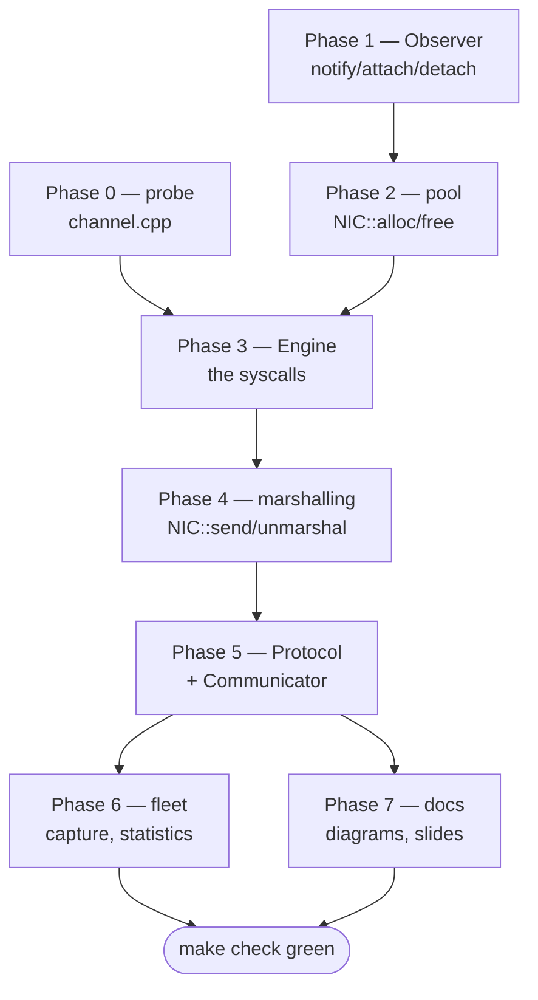

# Implementation roadmap — libvcomm Stage 1

A working document, not a panel artefact (what the panel reads is `doc/`).
Written on 2026-08-22.

---

## The constraint that sets the order

Artur is travelling 26–31 Aug and Fröhlich authorised bringing the date forward.
So the presentation is either **Monday the 24th or Tuesday the 25th** — two
days, today being Saturday — **or** after 31 Aug, which gives ten days. While the
date is unconfirmed, the roadmap assumes the tight hypothesis, because it is the
only one that can go wrong.

Practical consequence: **the acceptance checklist is not only C++.** `make` has
to run the whole evaluation, the latency has to come out automatically, and
diagrams and slides have to be in `doc/`. Whoever spends both entire days on the
Engine arrives at the panel with a pretty library and no presentation. Phases 6
and 7 have had a block reserved from the start.

**The line separating "I have something to show" from "I don't" is at the end of
Phase 5.**

---

## Dependencies

Phase 0 runs in parallel with Phases 1–2: if you get stuck on the Observer, go
to the probe and come back.

---

## Phase 0 — Raw socket probe · ~2 h · throwaway

Finish the `src/channel.cpp` you already started: a single program, no library
at all, that sends from one VM and receives on the other.

- **Do:** `socket` → `if_nametoindex` → `SIOCGIFHWADDR` → `bind` → `sendto` /
  `recvfrom`. Role from `argv[1]` (`send` or `recv`).
- **Verification:** VM 1 sends, VM 2 prints. Two VMs, the group's `SO2_MCAST`.
- **Why before the Engine:** they are the same five syscalls, with no class, no
  signal, no pool. You learn the mechanism in isolation and then **port** it to
  the Engine, instead of debugging syscalls and architecture at the same time.
  It is the only phase whose code goes in the bin — and it is still worth the
  time.
- **Trap:** `htons()` on `socket()`'s third argument. Without it the kernel
  filters by `0xB588` and you receive nothing, with no error at all.

> If you have already proved this to yourself in another session, skip straight
> to Phase 1.

---

## Phase 1 — Observer · ~1 h · **start here**

`Conditionally_Data_Observed::attach` / `detach` / `notify`, in
`include/observer.h`.

- **Verification:** `make test-stack` — the 4 checks in section 1.
  **Done** (Aug 24): green.
- **The contract that matters:** `notify()` returns `false` when nobody was
  listening for that condition. That `false` is what tells the NIC "you can
  release the buffer". If you always return `true`, the leak only shows up after
  32 messages — during the demo.
- **Why first:** it is the cheapest phase in the project and it unblocks NIC and
  Protocol at the same time. The best unblocking-per-hour ratio in the whole
  roadmap.

---

## Phase 2 — Buffer pool · ~1–2 h

`NIC::alloc` and `NIC::free`, in `include/nic.h`.

- **Verification:** section 3 of `test-stack`, including the checks inside the
  `if(first)` that only run once `alloc()` returns a buffer.
  **Done** (Aug 24): green.
- **Your decision:** `alloc()` fills in a **send** header. Reception needs a
  buffer without a built header — a separate `alloc_receive()`, or a parameter?
  Decide now and write it in `doc/design-decisions.md`; Phase 3 depends on it.
- **Trap:** the exhaustion test exists on purpose. An exhausted pool returning
  `0` is **correct** behaviour, not a fatal error.

---

## Phase 3 — Engine · ~3–4 h · **the highest-risk phase**

`src/raw_socket_engine.cpp`: steps 3 to 5 (arming the signal, `drain`,
`engine_stop`); plus `NIC::handle` in `nic.h`. The constructor and `engine_send`
are already done.

- **Reception is by SIGNAL, not by thread** — an assignment requirement, see
  `doc/design-decisions.md` §2.1. The steps commented in the `.cpp` follow that
  order.
- **Intermediate check 1:** the constructor prints the MAC it read; compare it
  against `ip -br link` **inside the VM** (on the host, `socket(AF_PACKET)`
  fails with `EPERM`). Do not move on until that matches.
- **Intermediate check 2:** a `write(2)` in the handler proves it fires, before
  you write a single line of `drain()`.
- **Phase verification:** VM 1 sends through the `NIC`, VM 2 receives and
  `handle()` prints.
- **The constraint that rules this phase:** everything reachable from `handle()`
  runs in signal context. No `printf`/stdio, no `malloc`/`new`, no `std::mutex`
  (`man 7 signal-safety`). `list.h` was already rewritten lock-free because of
  it; your `NIC::handle` has to respect the same limit.
- **Payoff:** question 3 of the guide ("how will a blocked receiver terminate
  cleanly") ceases to exist — there is no blocked receiver. Disarming is
  removing `O_ASYNC`. Say that in the presentation.
- **New trap:** a local `Ethernet::Frame` inside the handler is 1514 bytes on
  the stack of the interrupted thread, which is not one you chose.
- **Trap measured on this bench:** QEMU's `virtio-net` does **not** pad to 60
  bytes. `size = received - 14` works here and breaks on real hardware and in
  Stage 2. If you want a correct size on any medium, it has to travel in a
  `Protocol::Header` field — a decision Phase 5 will demand.

---

## Phase 4 — Marshalling · ~1–2 h

`NIC::send(Address, prot, data, size)`, `NIC::send(Buffer*)`,
`NIC::unmarshal`.

- **Verification:** the roundtrip test in section 4 of `tests/test_stack.cpp`:
  build with `alloc()`, pass through `unmarshal()`, check that `src`, `dst` and
  the bytes come back identical.
  **Done** (Aug 24): green. The whole `test-stack` is at 23 checks, 0 failures.
- **Why the test is worth it:** it is what catches byte-order and header-offset
  errors **on the host, in seconds**, instead of with tshark at two in the
  morning.

---

## Phase 5 — Protocol + Communicator · ~2–3 h · **the demo line**

`include/protocol.h` and `include/communicator.h`.

- **Verification:** five VMs. VM 1 transmits, VMs 2–5 print `RESULT ... OK`.
  That closes the "four receivers prove reception from one sender" checklist
  item.
- **PDF trap:** `Communicator::receive()` — the assignment passes
  `message->size()` as the capacity. On a freshly constructed message that is
  **0** and you receive zero bytes forever, with no error. Capacity on the way
  in, received size on the way out, different fields.
- **From here on you have something to show.** If time runs out after this
  phase, see "Emergency cuts".

---

## Phase 6 — Fleet, capture, statistics · ~3–4 h

`scripts/run-fleet.sh`, `capture.sh`, `analyze-capture.sh`,
`install-initramfs.sh`, and switching the Makefile's `.DEFAULT_GOAL` to `check`.

- **Verification:** `make check` runs end to end **and fails** when a receiver
  loses a frame, when a VM blows the timeout, or when the capture comes back
  empty. A test that only prints a warning is not gradeable — it says so in the
  guide.
- **Before measuring anything:** `ip route get 239.10.10.10`. On this machine it
  answers `dev wlp0s20f3` — the bus goes out over WiFi. Capturing on `lo`
  returns an empty capture. `sudo ip route add 239.10.10.0/24 dev lo` pins the
  bus to the machine.
- **Honest label:** if you measured request→response, it is round-trip. And say
  the bench runs in TCG, without `/dev/kvm` — the number is dominated by
  emulation noise. Reporting that is stronger than a pretty number with no
  context.

---

## Phase 7 — Documentation and slides · ~2–3 h · **not optional**

- Diagrams in `doc/`: fleet topology, layers, and the sequence of a message from
  `send()` until the application thread wakes up, marking where the signal
  context begins and ends. The assignment requires them.
- `doc/design-decisions.md` already has the nine deviations from the PDF's API.
  What is left is filling in §4's open items and checking that every decision
  you made in Phases 2, 3 and 5 is there.
- Slides in `doc/`, with the performance evaluation.
- The graded commit has to be on `main`.

---

## Weekend plan (hypothesis: presentation Monday or Tuesday)

| When | What |
|---|---|
| Sat 22, afternoon/evening | Phases 0, 1, 2 — probe working and `test-stack` green |
| Sun 23, morning | Phase 3 — Engine; two VMs talking through the `NIC` |
| Sun 23, afternoon | Phases 4 and 5 — five VMs, four receivers proving |
| Sun 23, evening | Phase 6 — `make check` |
| Mon 24, morning | Phase 7 — diagrams and slides |

If Phase 5 is not standing by Sunday evening, **stop coding and go to Phase 7.**
A partial demo explained well is worth more than a complete one with no slides.

---

## Emergency cuts

If time gets tight, cut **in this order** — from least painful to most:

1. **Synchronous `NIC::receive()`.** It is redundant with the
   `handle()`/`notify()` pair in this architecture. Leave it returning `-1` and
   **explain the decision in `doc/`**. A documented dead method is better than a
   hidden one.
2. **The `NIC::address(Address)` setter.** Stage 1 uses `eth0`'s real MAC and
   lets nobody change it. Same rule: document it.
3. **The percentile in the statistics.** Deliver count, mean, min and max; the
   guide says "preferably" for the percentile.
4. **Forking the components.** One process per VM still models five vehicles and
   satisfies the part of the checklist about VMs. Modelling components as POSIX
   processes is an assignment requirement, so this is **declared** debt in the
   presentation, not forgotten debt — and it is exactly where Stage 2 begins.

What is **not** cut, because they are explicit acceptance-checklist items:
broadcast as the destination, a dedicated EtherType, five VMs, four receivers
proving reception, a `make` that fails when it should, automatic latency, and
`doc/`.

---

## Signs you have gone off track

- You are editing `nic.h` or `protocol.h` to make the raw socket work → some
  syscall leaked out of the Engine. It is the first thing Fröhlich will look
  for.
- `make test-support` went red → you broke the foundation, not your new layer.
- You are debugging with `printf` inside the handler → besides the output
  possibly not appearing (stdout is buffered), `printf` is **not
  async-signal-safe**: if the signal arrives in the middle of a `printf` in
  `main`, you corrupt the stdio buffer. Use `write(2)`.
- You needed a `std::mutex` on the reception path → stop. Locking a mutex inside
  a handler that interrupted the thread already holding it is immediate
  deadlock, and it will show up under load, during the demo.
- You spent more than an hour on a phase estimated at one hour → ask, do not
  push on. The estimates assume a first time with raw sockets, but they do not
  assume getting stuck alone.
