# Documentação UML — libvcomm

**Biblioteca de comunicação para sistemas autônomos críticos**
INE5424 — Sistemas Operacionais II — UFSC — 2026/2 — Grupo M10 — Etapa 1

> Documento gerado por **engenharia reversa** do código-fonte, conferido contra
> `main` em **`9426f3b`** (*fix nic buffer and add timeout to updated()* —
> incluído). Todos os diagramas refletem o estado real do
> repositório, incluindo os pontos ainda não implementados: marcados com o
> estereótipo `«TODO»` e consolidados na
> [§4.4 Matriz de fidelidade](#44-matriz-de-fidelidade-código-vs-diagrama).
> Diagramas em sintaxe **Mermaid.js**; instruções de exportação para PNG na
> [§5](#5-exportação-para-png).

---

## Índice

| Seção | Conteúdo |
|---|---|
| [1. Arquitetura de Alto Nível](#1-arquitetura-de-alto-nível) | Componentes, pacotes e implantação |
| [2. Diagramas de Classes](#2-diagramas-de-classes-detalhados) | Cinco contextos arquiteturais |
| [3. Diagramas Comportamentais](#3-diagramas-comportamentais) | Sequência e atividade |
| [4. Anexos](#4-anexos) | Estados, legenda, rastreabilidade, fidelidade |
| [5. Exportação para PNG](#5-exportação-para-png) | CLI e extensões |

---

## Visão geral do sistema

`libvcomm` é uma pilha de comunicação em camadas, **header-only**, escrita em
C++17 no estilo do sistema operacional EPOS. Cada veículo é uma VM QEMU; cada
componente do veículo é um processo POSIX. As VMs conversam por **quadros
Ethernet crus em broadcast**, sem IP.

Dois princípios governam todo o desenho e explicam praticamente cada decisão
registrada neste documento:

1. **Isolamento de syscall.** Somente a classe `Raw_Socket_Engine` faz chamadas
   de sistema de rede. `NIC`, `Protocol` e `Communicator` não sabem que sockets
   existem. É essa promessa que permite trocar apenas o *Engine* na Etapa 2
   (memória compartilhada).
2. **Contexto de interrupção.** A recepção é propagada por **sinal POSIX
   (`SIGIO`)** — o análogo fiel da interrupção de hardware do EPOS. Todo o
   trecho entre `drain()` e `semaphore.v()` executa **dentro do tratador de
   sinal** e está sujeito a *async-signal-safety* (`man 7 signal-safety`): sem
   `printf`, sem `malloc`/`new`, sem `std::mutex`, sem `std::string`.

A parametrização por *policy* (`NIC<Engine>`, `Protocol<NIC>`,
`Communicator<Channel>`) é o mecanismo estrutural que sustenta o princípio 1; o
padrão **Observer × Observed em duas famílias** é o que sustenta o princípio 2.

---

# 1. Arquitetura de Alto Nível

## 1.1 Diagrama de Componentes — camadas e fronteiras

Cada camada recebe a camada inferior **já construída** e nunca a instancia. As
duas fronteiras horizontais destacadas são as invariantes arquiteturais do
sistema.

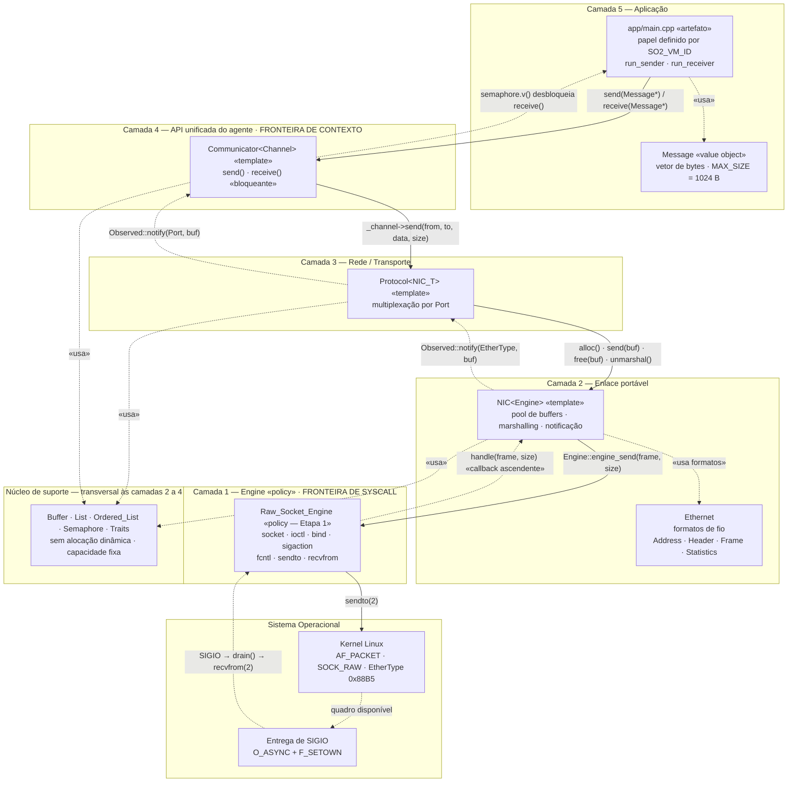

**As duas fronteiras.** *Camada 1* é a **fronteira de syscall**: nada acima dela
conhece sockets, e é essa promessa que permite trocar apenas o *Engine* na Etapa
2 — a substituição está modelada em
[§2.5](#instanciação-da-pilha-concreta--libvcommh), onde `Raw_Socket_Engine` e o
futuro `Shared_Memory_Engine` aparecem como realizações do mesmo contrato.
*Camada 4* é a **fronteira de contexto**: o `Communicator` é o último objeto
tocado dentro do tratador de `SIGIO` — `v()` deposita e retorna —, e o primeiro
tocado de volta na thread da aplicação, quando `p()` acorda.

**Leitura das setas.** As **contínuas** descem: é o caminho de transmissão,
chamada síncrona comum, na thread da aplicação. As **pontilhadas** sobem: é o
caminho de recepção, notificação assíncrona originada no tratador de `SIGIO`.
Toda a subida — de `handle()` até `semaphore.v()` — executa **dentro do
tratador**, e é por isso que a fronteira de contexto está desenhada exatamente
no `Communicator`: `v()` deposita e retorna, e quem acorda do outro lado, já na
thread da aplicação, é o `p()` de `receive()`.

## 1.2 Diagrama de Pacotes — grafo real de dependências

Grafo extraído das diretivas `#include` do projeto. Note que
`engine/raw_socket_engine.h` depende **apenas** de `ethernet.h` — é o que
garante que um *Engine* alternativo seja plugável.

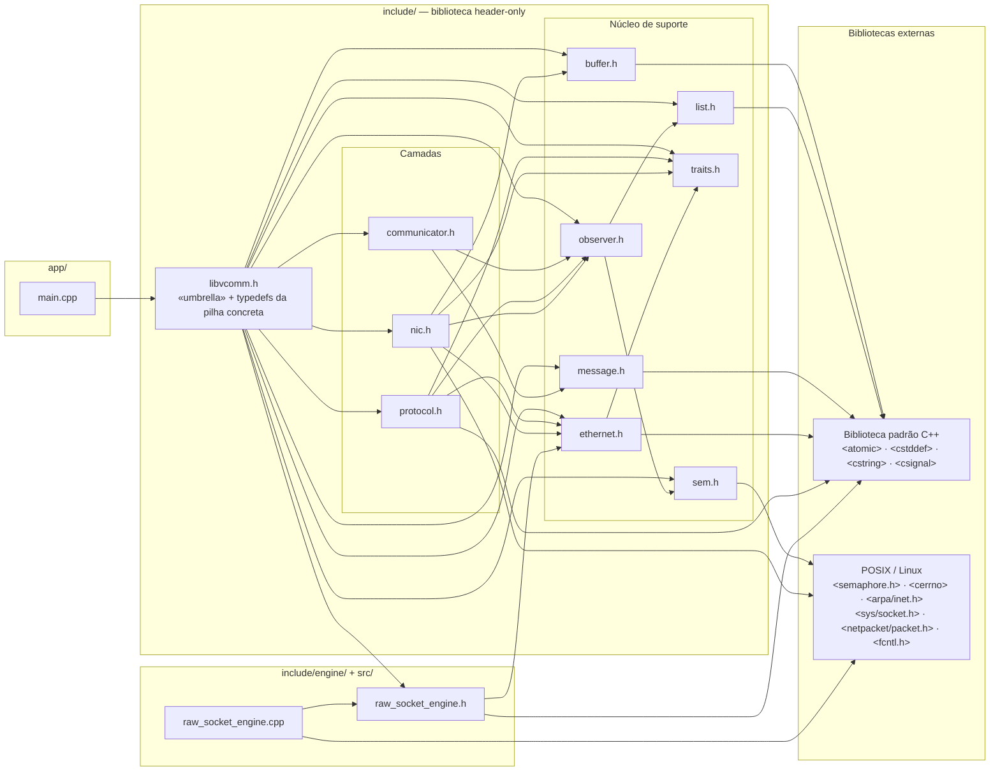

> **Como ler.** Toda seta é uma diretiva `#include` real, na direção
> *inclui → incluído*. O grafo é acíclico e `traits.h` é sua única folha
> interna: `traits.h` é o ponto exclusivo de configuração da biblioteca
> (EtherType, interface, tamanho do pool) e **não depende de nada** — nenhum
> arquivo de configuração depende de código.
>
> A aresta que sustenta a Etapa 2 é a ausência de arestas: `raw_socket_engine.h`
> alcança apenas `ethernet.h` e `<csignal>`. Ele não conhece `nic.h`, e é por
> isso que um *Engine* alternativo é plugável.

## 1.3 Diagrama de Implantação — a frota

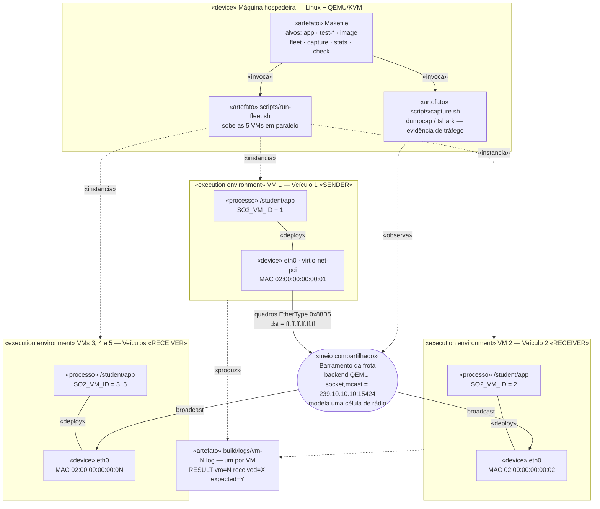

> **Onde há IP e onde não há.** Dentro das VMs **não existe pilha IP**: o
> `Raw_Socket_Engine` emite quadros Ethernet crus com EtherType 0x88B5 e destino
> `ff:ff:ff:ff:ff:ff`. O endereço `239.10.10.10:15424` é do **backend do QEMU no
> hospedeiro** (`-netdev socket,mcast=…`), que encapsula esses quadros em UDP
> multicast para que as cinco VMs compartilhem um único domínio de colisão. Os
> dois níveis não se misturam — e é essa distinção que a captura em `lo` mostra.

**Restrição de implantação relevante.** `Raw_Socket_Engine::_instance` é um
ponteiro **estático**, usado como *trampolim* do tratador de sinal — e a
disposição de sinais é estado global do processo. Consequência: **um Engine por
processo**. Na Etapa 1 isso não incomoda (1 VM = 1 veículo = 1 NIC); é a
primeira premissa a revisitar quando um veículo virar vários processos.

---

# 2. Diagramas de Classes Detalhados

> **Convenções de notação.** Visibilidade `+` público, `-` privado, `#`
> protegido. Membro **sublinhado** = estático (marcado `$` no fonte Mermaid);
> método em *itálico* = virtual puro. Abreviações de tipo: `uint` =
> `unsigned int`, `ushort` = `unsigned short`, `uchar` = `unsigned char`. Todo
> parâmetro de template aparece no estereótipo — `«template T, C, CAP»` — e a
> notação `Classe~T~` é usada apenas no nome quando há um parâmetro dominante.
> Classes **aninhadas** em C++ são agrupadas num pacote que nomeia o hospedeiro
> — aninhamento é relação entre *tipos*, não entre objetos, e por isso **não** há
> composição do hospedeiro para elas: `*--` só aparece onde existe de fato um
> membro por valor. Instanciação de template é dependência `«bind»`, do tipo
> ligado para o template — nunca realização. Detalhes em
> [§4.3](#43-legenda-de-notação).

## 2.1 Contexto: Núcleo de Suporte

Classes de infraestrutura, todas **livres de alocação dinâmica** e com
capacidade fixa — requisito imposto pela execução em contexto de sinal.

```mermaid
classDiagram
    direction TB

    class Traits~T~ {
        <<template T>>
        +bool debugged$
    }

    class Traits_Ethernet {
        <<template specialization>>
        +const char* INTERFACE$
        +ushort PROTOCOL_NUMBER$
        +uint SEND_BUFFERS$
        +uint RECEIVE_BUFFERS$
        +bool debugged$
    }

    class Buffer~T~ {
        <<template T>>
        -T _frame
        -uint _size
        -atomic_bool _in_use
        +Buffer()
        +T* frame()
        +uint size()
        +void size(uint s)
        +bool lock()
        +void unlock()
        +bool in_use()
    }

    class List~T~ {
        <<template T, CAP = 32>>
        -T* _slot[CAP]
        -atomic_uint _head
        -atomic_uint _tail
        +uint CAPACITY$
        +List()
        +bool insert(T* e)
        +T* remove()
        +bool empty()
        +uint size()
    }

    class Ordered_List~T~ {
        <<template T, C, CAP = 16>>
        -atomic_ptr _slot[CAP]
        -atomic_uint _size
        +uint CAPACITY$
        +Ordered_List()
        +Iterator begin()
        +Iterator end()
        +bool insert(T* e)
        +void remove(T* e)
        +uint size()
        +bool empty()
    }

    class Iterator {
        <<nested em Ordered_List>>
        -const atomic_ptr* _p
        -const atomic_ptr* _e
        +Iterator(p, e)
        +T* operator_deref()
        +T* operator_arrow()
        +Iterator operator_inc()
        +bool operator_eq(Iterator i)
        +bool operator_neq(Iterator i)
        -void skip()
    }

    class Semaphore {
        -sem_t _sem
        +Semaphore(int init)
        +void p()
        +void v()
        +bool try_p()
        +int value()
    }

    class Message {
        -uchar _data[MAX_SIZE]
        -uint _size
        +uint MAX_SIZE$
        +Message()
        +Message(const void* data, uint size)
        +void* data()
        +uint size()
        +void size(uint s)
        +uint set(const void* data, uint size)
    }

    Traits_Ethernet ..> Traits : «bind» T = Ethernet
    Iterator ..> Ordered_List : «nested» percorre saltando lápides

    note for List "CAP = 32, potência de 2: o wraparound é um AND, não um módulo.<br/>Uma posição fica sempre vazia para distinguir cheio de vazio → CAPACITY = CAP-1 = 31.<br/>Produtor = tratador de sinal (insert); consumidor = thread da aplicação (remove)."
    note for Ordered_List "CAP = 16, CAPACITY = 16. detach() não compacta: escreve 0 na posição (lápide).<br/>Compactar deslocaria índices sob uma travessia em curso dentro do tratador.<br/>_size é marca d'água: só cresce; size() conta os vivos, ignorando lápides."
    note for Buffer "lock() usa test-and-set atômico (exchange acq_rel).<br/>Desde 9426f3b o pool da NIC é PARTICIONADO: envio e recepção têm 16 posições<br/>cada e não disputam mais as mesmas — ver a nota da NIC em §2.3."
    note for Semaphore "sem_post(3) é async-signal-safe — é o que torna legal<br/>notificar de dentro do tratador. sem_wait() retorna EINTR: o laço de p() relança."
    note for Message "Etapa 1: M = {.*}, só bytes. As Etapas 2 a 6 acrescentam<br/>origem, timestamp, tipo e MAC — o espaço está reservado, o código não."
```

**Por que capacidade fixa.** `pthread_mutex_lock` e `malloc` **não** constam da
lista de funções *async-signal-safe*. Como a recepção acontece dentro de um
tratador de sinal, `List` e `Ordered_List` foram construídas sobre
`std::atomic` *lock-free* — os `static_assert` de `list.h` fazem o compilador
provar isso na plataforma alvo. O preço é não poder crescer: as duas estruturas
respondem "não" quando enchem, em vez de alocar.

## 2.2 Contexto: Padrão Observer × Observed

O coração do desacoplamento. **Duas famílias**, e a diferença entre elas é a
razão de ambas existirem.

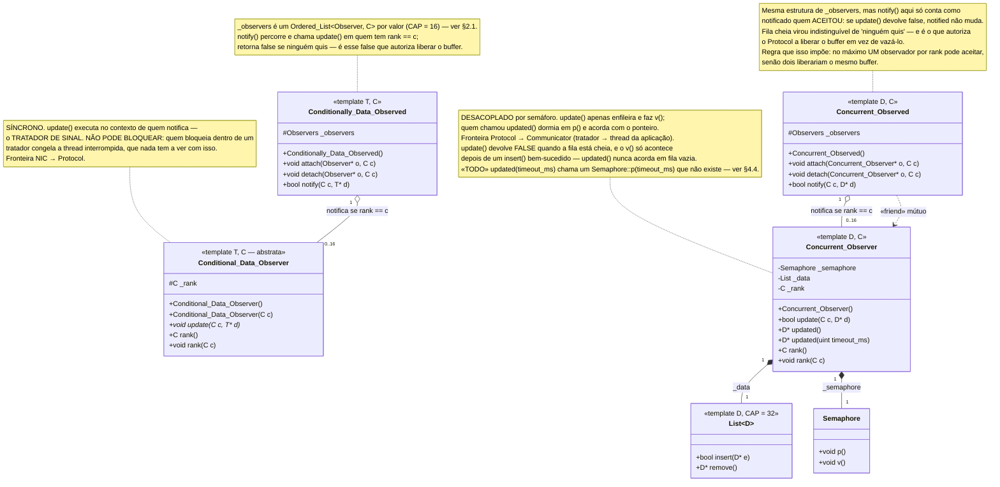

### Por que duas famílias — e não uma

| Fronteira | Família | Justificativa |
|---|---|---|
| `NIC` → `Protocol` | `Conditionally_Data_Observed` | executa dentro do tratador de sinal; **não pode bloquear** |
| `Protocol` → `Communicator` | `Concurrent_Observed` | do outro lado há uma thread de aplicação adormecida; **precisa do semáforo** — e `sem_post` é *async-signal-safe* |

O **rank** é a *condição*: para a `NIC` o rank é o EtherType; para o `Protocol`
é a `Port`. `notify(c, d)` só chama os observadores cujo `rank == c` — é isso, e
somente isso, que "condicional" significa aqui. O retorno `false` de `notify()`
significa *ninguém quis este quadro* e é o que autoriza a liberação do buffer.

**As duas famílias divergiram em `9426f3b`, e a diferença importa.** Em
`Concurrent_Observed::notify()` o `update()` do observador passou a devolver
`bool`, e só conta como notificado quem **aceitou** — de modo que fila cheia é
indistinguível de "ninguém quis" e o `Protocol` libera o buffer nos dois casos.
Em `Conditionally_Data_Observed::notify()` isso **não** aconteceu: `update()`
segue `void` e `notified` vira `true` só por ter havido a chamada. Consequência
prática, e é a origem do item 4 da [§4.4](#44-matriz-de-fidelidade-código-vs-diagrama):
quando a fila do `Communicator` enche, a `NIC` continua contando `rx_packets`,
porque do ponto de vista dela *houve* um `Protocol` interessado no EtherType.

Essa assimetria também impõe uma regra de posse: **no máximo um observador por
rank pode aceitar**, senão dois liberariam o mesmo buffer. Cada processo desta
biblioteca liga um `Communicator` por porta, então a regra vale por construção —
mas vale por construção, não por verificação.

## 2.3 Contexto: Camada de Enlace

Herança **múltipla e mista** é o traço central desta camada: a `NIC` herda
`Ethernet` (formatos) e `Conditionally_Data_Observed` (papel de observado) em
público, e o `Engine` em **privado**.

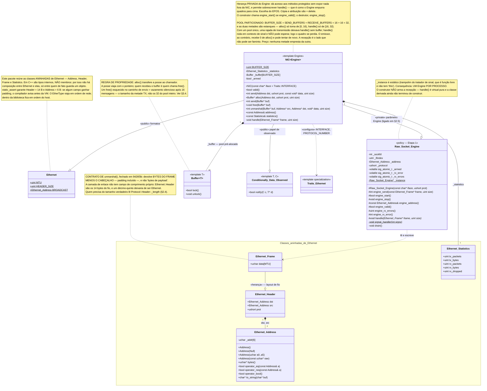

## 2.4 Contexto: Camada de Rede / Transporte

O `Protocol` tem **duas faces**, e é essa dobra que torna a recepção assíncrona
de ponta a ponta sem *rendezvous*.

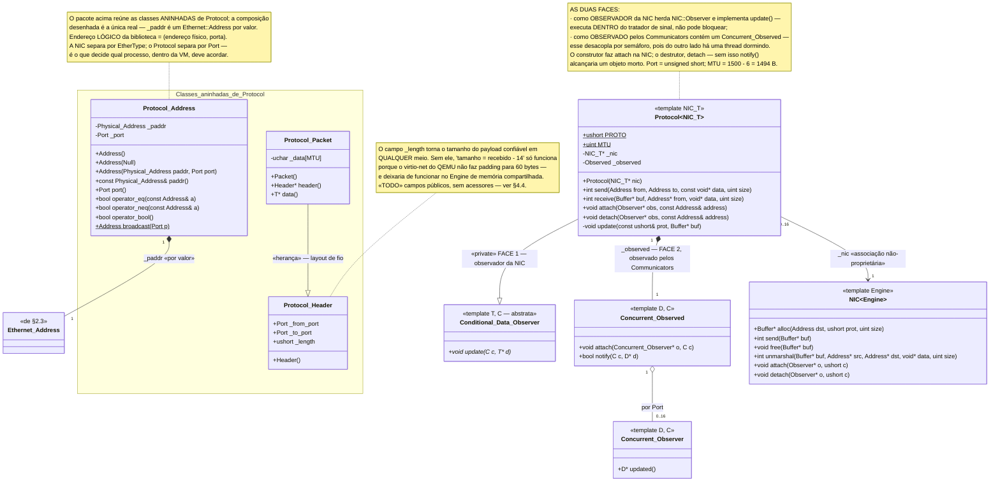

### Encapsulamento de cabeçalhos (visão de fio)

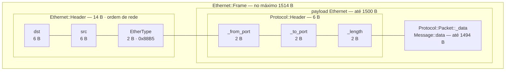

> **As larguras dos blocos não estão em escala** — cada caixa traz o seu tamanho
> em bytes. Os dois `static_assert` de `ethernet.h` e o `__attribute__((packed))`
> de `Ethernet::Header`, `Protocol::Header` e `Protocol::Packet` são o que garante
> que este desenho e a memória coincidam.

## 2.5 Contexto: Aplicação e Instanciação de Templates

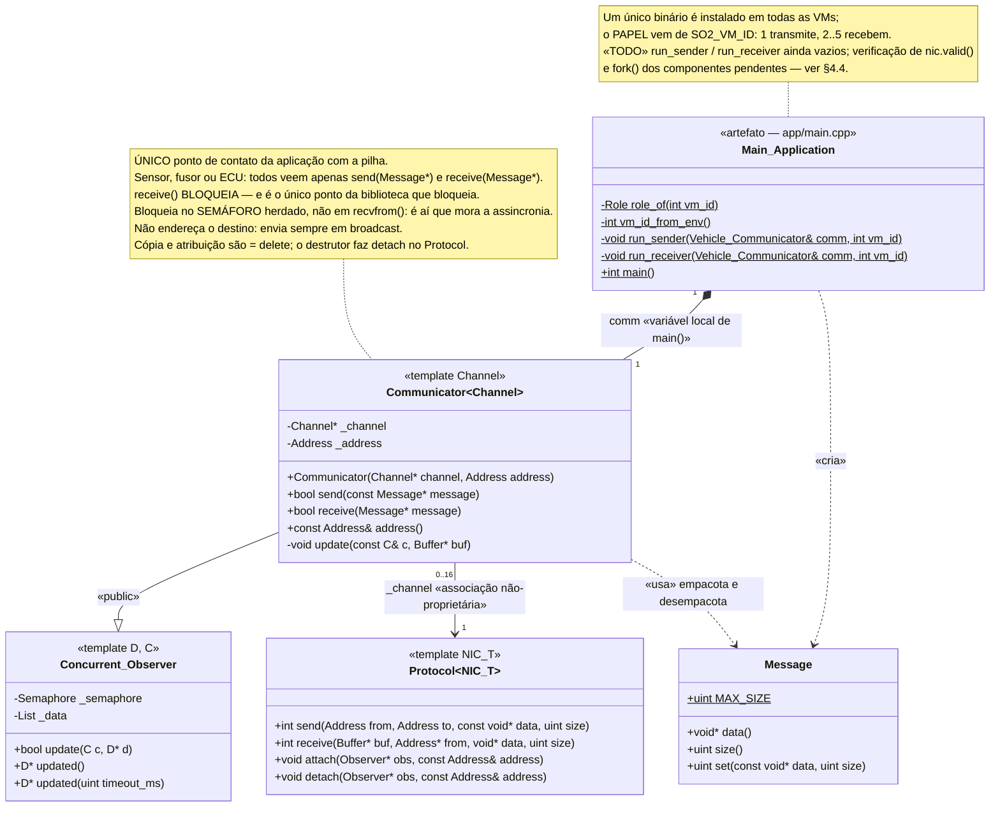

### Instanciação da pilha concreta — `libvcomm.h`

O ponto **exato** onde os templates viram tipos reais. É a única linha que muda
quando a Etapa 2 trouxer o *Engine* de memória compartilhada — e se essa troca
exigir tocar em `NIC`, `Protocol` ou `Communicator`, a separação de camadas
falhou em algum lugar.

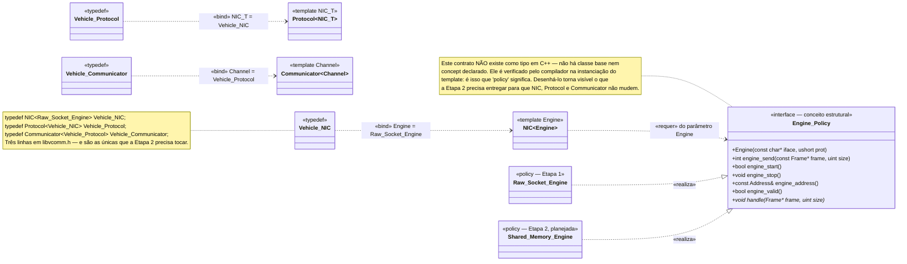

---

# 3. Diagramas Comportamentais

## 3.1 Sequência — Inicialização da pilha (bootstrap)

A ordem de construção **não é acidental**: cada camada recebe a inferior já
pronta, e o armamento da recepção acontece por último, depois que todo o estado
que `handle()` toca já existe.

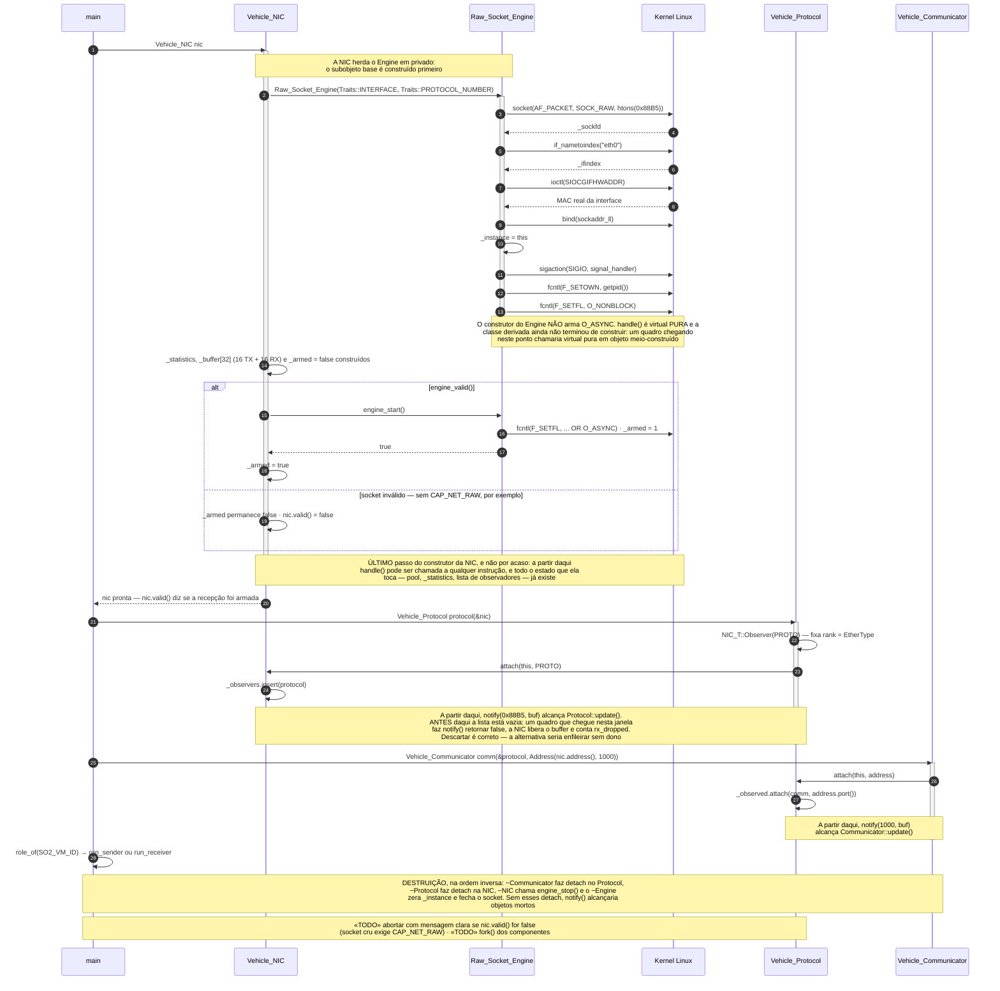

## 3.2 Sequência — Transmissão: `Communicator::send()` até `sendto(2)`

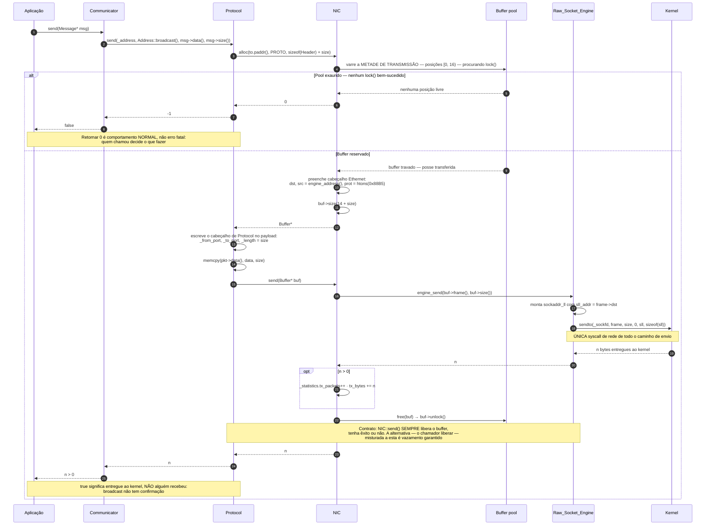

## 3.3 Sequência — Recepção assíncrona via `SIGIO` (fluxo mais crítico)

Este é o diagrama que resume a arquitetura. As linhas de vida estão ordenadas
**da base da pilha para o topo** — `Kernel → … → Aplicação` — de modo que todo o
caminho de recepção avança para a direita, sem cruzamentos. A **faixa
sombreada** não é um conjunto de objetos: é um **intervalo de tempo**. Tudo o
que acontece dentro dela executa no tratador de `SIGIO`, com a thread da
aplicação parada. O encontro entre os dois mundos é exatamente o par
`v()` / `p()`.

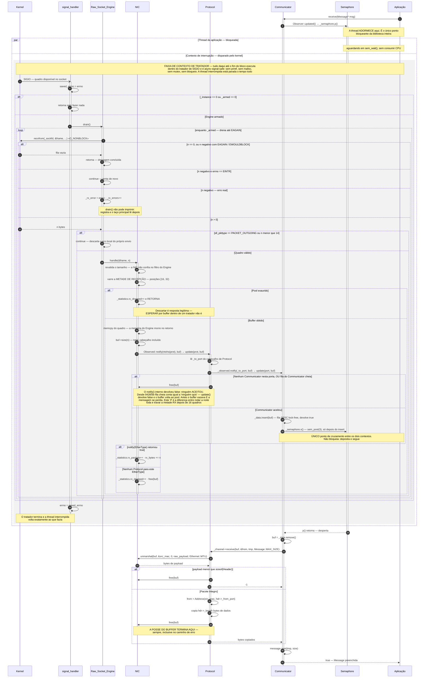

> **Uma leitura atenta deste diagrama revela um defeito real do código.** O ramo
> "Communicator registrado" depende de `_to_port` coincidir com a porta em que o
> `Communicator` fez `attach`. Hoje `Communicator::send()` endereça
> `Address::broadcast()`, cujo `Port` vale **0**, enquanto `main()` registra o
> `Communicator` na porta **1000** — logo `notify(0, buf)` não encontra
> observador e o quadro é liberado sem chegar à aplicação. O diagrama descreve o
> contrato pretendido; a divergência está registrada na
> [§4.4](#44-matriz-de-fidelidade-código-vs-diagrama).

### Por que semáforo e não *rendezvous*

O enunciado proíbe *rendezvous* na recepção — e há uma razão de projeto além da
regra. O semáforo **desacopla no tempo**: o produtor (o tratador de sinal) faz
`v()` e segue sem esperar ninguém; o consumidor faz `p()` e dorme até haver
dado. Se a mensagem chegar **antes** de a aplicação chamar `receive()`, o
contador do semáforo já vale 1 e `p()` retorna imediatamente — nada se perde. É
exatamente essa memória de um evento passado que falta a um *rendezvous*.

## 3.4 Sequência — Ciclo de vida e posse do `Buffer`

A pergunta clássica de banca: *quem é dono de um buffer recebido, e quando ele é
liberado?* Este diagrama consolida os **cinco pontos de liberação** e o único
ponto de falha de alocação.

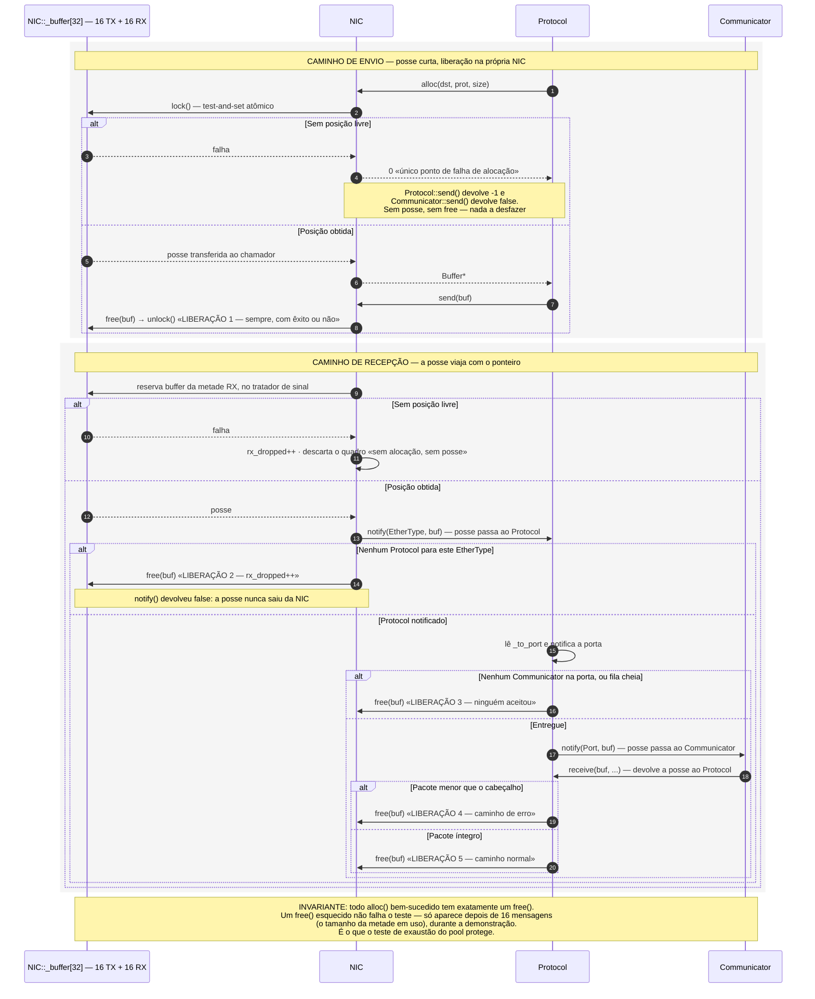

## 3.5 Diagrama de Atividade — `Raw_Socket_Engine::drain()`

O laço de drenagem é o que garante a entrega **independentemente do número de
sinais**: sinais padrão não se enfileiram — dois quadros em rajada geram um
único `SIGIO` — mas um `SIGIO` faz `drain()` esvaziar a fila inteira. É por isso
que a garantia mora no laço, e não na contagem de sinais.

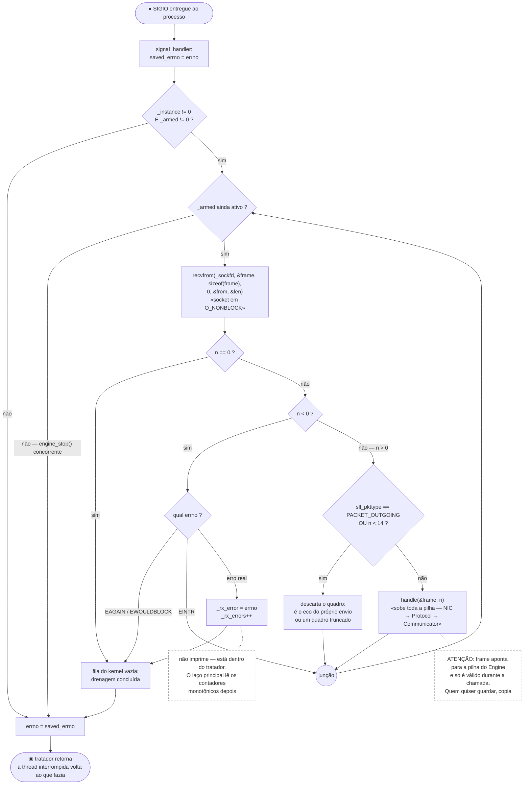

> **Leitura da notação.** Os retângulos de canto arredondado são os nós inicial e
> final; os losangos, nós de decisão; o círculo **junção** é o nó de união que
> devolve o fluxo ao laço; as duas caixas tracejadas são **notas**, não ações —
> não executam nada. As três saídas que terminam em *drenagem concluída*
> correspondem, no código, aos três `return` de `drain()`.

---

# 4. Anexos

## 4.1 Diagrama de Estados — ciclo de vida do `Raw_Socket_Engine`

Notação das transições: `gatilho [guarda] / efeito`.

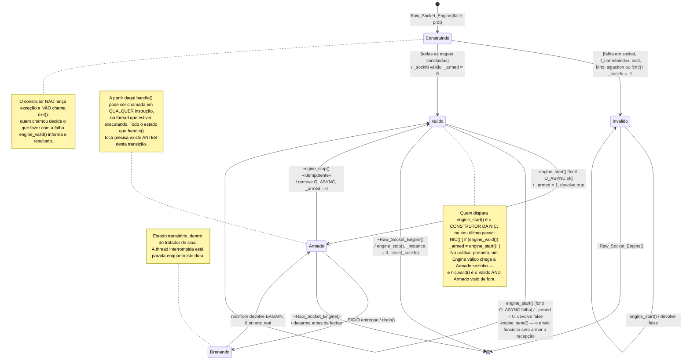

## 4.2 Matriz de rastreabilidade — classe → arquivo

| Classe / Artefato | Arquivo | Papel arquitetural |
|---|---|---|
| `Traits<T>` · `Traits<Ethernet>` | [../include/traits.h](../include/traits.h) | Ponto único de configuração |
| `Ethernet` + `Address` · `Header` · `Frame` · `Statistics` | [../include/ethernet.h](../include/ethernet.h) | Formatos de fio da camada de enlace |
| `Buffer<T>` | [../include/buffer.h](../include/buffer.h) | Unidade de posse — *zero-copy* pela pilha |
| `List<T,CAP>` · `Ordered_List<T,C,CAP>` · `Iterator` | [../include/list.h](../include/list.h) | Coleções *lock-free* de capacidade fixa |
| `Semaphore` | [../include/sem.h](../include/sem.h) | Desacoplamento temporal tratador ↔ thread |
| `Message` | [../include/message.h](../include/message.h) | Unidade de dados da aplicação |
| `Conditional_Data_Observer` · `Conditionally_Data_Observed` · `Concurrent_Observer` · `Concurrent_Observed` | [../include/observer.h](../include/observer.h) | Padrão Observer nas duas famílias |
| `Raw_Socket_Engine` | [../include/engine/raw_socket_engine.h](../include/engine/raw_socket_engine.h) · [../src/raw_socket_engine.cpp](../src/raw_socket_engine.cpp) | *Policy* — único ponto de syscall |
| `NIC<Engine>` | [../include/nic.h](../include/nic.h) | Enlace portável: pool, *marshalling*, notificação |
| `Protocol<NIC>` | [../include/protocol.h](../include/protocol.h) | Multiplexação por porta; a dobra do Observer |
| `Communicator<Channel>` | [../include/communicator.h](../include/communicator.h) | API unificada do agente |
| `Vehicle_NIC` · `Vehicle_Protocol` · `Vehicle_Communicator` | [../include/libvcomm.h](../include/libvcomm.h) | Instanciação da pilha concreta |
| Aplicação de teste | [../app/main.cpp](../app/main.cpp) | Papel por `SO2_VM_ID`; raiz do veículo |
| `Engine_Policy` (§2.5) | *sem arquivo* | Contrato estrutural do parâmetro `Engine`. Não existe como tipo em C++: é verificado pelo compilador na instanciação de `NIC<Engine>` |

## 4.3 Legenda de notação

### Relacionamentos usados

| Sintaxe Mermaid | UML | Semântica neste projeto |
|---|---|---|
| `A --\|> B` | Generalização (linha cheia, triângulo vazado) | Herança C++. O estereótipo indica `«public»` ou `«private»` |
| `A ..\|> B` | Realização (tracejada, triângulo vazado) | `A` cumpre um contrato de `B` (ex.: `Raw_Socket_Engine ..\|> Engine_Policy`) |
| `A ..> B : «bind»` | *Template binding* (tracejada, ponta aberta) | `A` é a instanciação do template `B` — `typedef`, ou especialização de `Traits`. **Não** é realização: a seta parte do tipo ligado e aponta para o template |
| `A *-- B` | Composição (losango cheio) | `B` é membro **por valor** de `A` e morre com ele (ex.: o pool de `Buffer` na `NIC`). Desenhada **apenas** onde existe um membro real |
| `A o-- B` | Agregação (losango vazado) | `A` guarda ponteiros para `B` mas **não** o possui (ex.: `Observed` e seus observadores) |
| `A --> B` | Associação direcional | `A` guarda um ponteiro não-proprietário para `B` (ex.: `Protocol::_nic`) |
| `A ..> B` | Dependência | `A` usa `B` sem armazená-lo (ex.: `NIC ..> Traits<Ethernet>`) |
| `namespace X { … }` | Pacote | Reúne as classes **aninhadas** de um hospedeiro (`Ethernet::Address`, `Protocol::Header`, …). Aninhamento em C++ é relação entre *tipos*, não entre objetos — por isso não há composição do hospedeiro para elas. Quando o aninhamento precisa ser explícito fora do pacote (o `Iterator` de `Ordered_List`, §2.1), usa-se dependência `«nested»` |
| `"1" … "0..16"` | Multiplicidade | Cardinalidade real, derivada das capacidades fixas do código (`Ordered_List` com `CAP = 16`, pool com 32 buffers) |

### Convenções de membros

| Marcação | Significado |
|---|---|
| `+` `-` `#` | Visibilidade pública, privada, protegida |
| membro **sublinhado** (`$` no fonte) | Membro **estático** |
| método em *itálico* (`*` no fonte) | **Virtual puro** (abstrato) |
| `«template T, C, CAP»` | Classe template, com todos os parâmetros nomeados no estereótipo; `Classe~T~` marca no nome apenas o parâmetro dominante |
| `uint` · `ushort` · `uchar` | `unsigned int` · `unsigned short` · `unsigned char` |
| `atomic_uint` · `atomic_bool` · `atomic_ptr` | `std::atomic<unsigned int>` · `std::atomic<bool>` · `std::atomic<T*>` — o `<>` colidiria com a notação de genéricos |
| `operator_eq` · `operator_neq` · `operator_deref` · `operator_arrow` · `operator_inc` | `operator==` · `operator!=` · `operator*` · `operator->` · `operator++` — renomeados para não colidir com os marcadores de sintaxe do Mermaid |
| destrutores omitidos | O caractere `~` é reservado à notação de genéricos do Mermaid e não pode abrir um nome de membro. Todas as classes com recurso a liberar (`Semaphore`, `Raw_Socket_Engine`, `NIC`, `Protocol`, `Communicator`) **têm** destrutor no código; seu efeito aparece nas notas de classe e nos diagramas de sequência (§3.1) e de estados (§4.1) |
| `«TODO»` | Declarado ou pretendido, mas **ainda não implementado** — ver §4.4 |

### Notação dos diagramas comportamentais

| Elemento | Onde | Significado |
|---|---|---|
| `alt` / `else` | §3.2 · §3.3 · §3.4 | Fragmento combinado alternativo; cada ramo traz a sua guarda entre colchetes |
| `loop` | §3.3 | Fragmento de repetição — o laço de drenagem |
| `par` / `and` | §3.3 | Fragmento paralelo: as duas raias progridem de forma independente |
| faixa sombreada (`rect`) | §3.3 · §3.4 | **Intervalo de tempo**, não conjunto de objetos: delimita o trecho que executa em contexto de tratador (§3.3) ou o caminho de posse em análise (§3.4) |
| seta aberta `-)` | §3.3 | Mensagem **assíncrona** — a entrega de `SIGIO` pelo kernel |
| seta tracejada | §3.1–§3.4 | Mensagem de **retorno** |
| `●` / `◉` | §3.5 | Nó inicial / nó final de atividade |
| losango | §3.5 | Nó de decisão |
| círculo *junção* | §3.5 | Nó de união — devolve o fluxo ao laço |
| caixa de borda tracejada | §3.5 | **Nota**: comentário, não ação executável |
| `gatilho [guarda] / efeito` | §4.1 | Rótulo de transição de máquina de estados, na forma canônica da UML |

## 4.4 Matriz de fidelidade — código vs. diagrama

Esta documentação é engenharia reversa, não especificação. A tabela abaixo é o
contrato de honestidade do documento: onde o diagrama descreve a **intenção** e
o repositório ainda não a cumpre, está registrado aqui.

> **Estado de referência:** `main` em `9426f3b` (*fix nic buffer and add timeout
> to updated()*). Esse commit **fechou** duas divergências que estavam nesta
> matriz — a política de fila cheia e o contrato de `unmarshal()` — e **abriu**
> duas novas, que hoje impedem a compilação. Os itens 1 e 2 abaixo são
> bloqueadores de build: nada nos diagramas de §3 executa enquanto existirem.

### Divergências abertas

| # | Elemento | Local | Estado real | Impacto arquitetural |
|---|---|---|---|---|
| 1 | **`Communicator::update()` não compila** | [communicator.h:109](../include/communicator.h#L109) × [observer.h:163](../include/observer.h#L163) | Continua devolvendo `void`; a base `Concurrent_Observer::update()` passou a devolver `bool` | **Bloqueia o build.** Retorno conflitante em função virtual — `make app` falha. §2.5 desenha a assinatura nova, que é a que a base exige |
| 2 | **`Semaphore::p(timeout_ms)` não existe** | [observer.h:188](../include/observer.h#L188) × [sem.h:42](../include/sem.h#L42) | `updated(timeout_ms)` foi escrito chamando um overload com prazo que nunca chegou ao `Semaphore` | **Bloqueia o build.** `make test-stack` falha. Precisa de um `bool p(unsigned ms)` sobre `sem_timedwait(3)`, com laço de `EINTR` — e `sem_timedwait` usa `CLOCK_REALTIME`, decisão a registrar |
| 3 | Porta do broadcast | [communicator.h:84](../include/communicator.h#L84) · [main.cpp:93](../app/main.cpp#L93) | `send()` endereça `Address::broadcast()`, cujo `Port` é **0**; o `Communicator` faz `attach` na porta **1000** | **Bloqueia a execução.** `notify(0, buf)` não encontra observador: o quadro é liberado e a aplicação nunca acorda. O caminho de §3.3 não fecha até emissor e receptor concordarem na porta |
| 4 | Comentário de `update()` descreve o contador errado | [observer.h:159](../include/observer.h#L159) | Afirma que, com a fila cheia, *"`NIC::handle()` counts it in `rx_dropped`"* | **Não é o que o código faz.** `Conditionally_Data_Observed::notify()` segue `void`-based e devolve `true` só por ter chamado `Protocol::update()`. Fila cheia ⇒ o `Protocol` libera o buffer e a `NIC` soma **`rx_packets`** — ver item 7 |
| 5 | `Protocol::Header` | [protocol.h:118](../include/protocol.h#L118) | Campos públicos, sem acessores | Quebra o encapsulamento do cabeçalho de fio; `Protocol::update()` e `receive()` leem os campos diretamente |
| 6 | `Protocol::send()` — retorno | [protocol.h:203](../include/protocol.h#L203) | Propaga o retorno de `NIC::send()`, que conta **cabeçalho + payload** | O contrato escrito no próprio cabeçalho fala em *bytes de payload*. Agora que `unmarshal()` teve o contrato fechado explicitamente, `send()` é o último dos dois em aberto |
| 7 | `NIC::_statistics.rx_packets` | [nic.h:224](../include/nic.h#L224) | Incrementado quando **algum `Protocol`** foi chamado, mesmo que nenhuma porta tenha aceito | Conta quadros que chegaram ao enlace, não mensagens entregues. Defensável para um contador de enlace — mas precisa ser dito assim na apresentação, e o item 4 mostra que o próprio código já se confundiu com isso |
| 8 | `run_sender()` · `run_receiver()` | [main.cpp:43](../app/main.cpp#L43) · [main.cpp:57](../app/main.cpp#L57) | Corpos vazios | Sem geração/verificação de tráfego; sem veredito `RESULT` para o script de teste. É o consumidor natural do novo `updated(timeout_ms)` |
| 9 | Verificação de `nic.valid()` | [main.cpp:84](../app/main.cpp#L84) | Ausente | Falha de `CAP_NET_RAW` passa silenciosa — o binário roda sem nunca receber nada |
| 10 | `fork()` dos componentes | [main.cpp:97](../app/main.cpp#L97) | Ausente | Um processo por veículo, não um por componente, como o enunciado pede |
| 11 | `scripts/run-fleet.sh` | [../scripts/run-fleet.sh](../scripts/run-fleet.sh) | Bloco `TODO`, `exit 1` | Frota de 5 VMs ainda não orquestrada |
| 12 | Alvos `image` · `fleet` · `capture` · `stats` | [../Makefile](../Makefile) | Esqueletos que imprimem `TODO` e falham | `make check` — o alvo de avaliação — ainda não fecha ponta a ponta |
| 13 | Referências penduradas em `design-decisions.md` | [nic.h:18](../include/nic.h#L18) · [nic.h:67](../include/nic.h#L67) · [observer.h:154](../include/observer.h#L154) | Os comentários citam `§2.6`, `§3` e a decisão `1.11` como se registrassem a partição do pool, o contrato de `unmarshal()` e o retorno `bool` — **`§2.6` e `1.11` não existem**, e `§3` é *"Honest limitations of the bench"* | A justificativa das três decisões vive só no comentário do código. `design-decisions.md` §4 ainda lista a política de fila cheia como aberta, embora já esteja fechada |

### Elementos do enunciado deliberadamente ausentes

Estes **não** são pendências: são decisões, e por isso não aparecem nos
diagramas de classes.

| Elemento | Local | Decisão |
|---|---|---|
| `NIC::receive(Address*, Protocol_Number*, void*, uint)` | [nic.h:86](../include/nic.h#L86) | Comentado. Método síncrono do PDF, redundante com o par `handle()`/`notify()` na arquitetura orientada a Observer. Sem caso de uso, fica fora da API em vez de existir devolvendo `-1` |
| `NIC::address(Address)` | [nic.h:158](../include/nic.h#L158) | Comentado. O MAC vem do kernel via `SIOCGIFHWADDR`; um *setter* só poderia mentir sobre o endereço real da interface |

Hoje a justificativa das duas vive apenas no comentário ao lado do código
(`// no use case for … yet`). A diferença entre "não implementei" e "decidi não
ter" é exatamente o que a banca pergunta: **vale promover as duas para
[design-decisions.md](design-decisions.md)** antes da entrega, ao lado das
demais decisões deliberadas.

---

# 5. Exportação para PNG

## 5.1 Via CLI — `scripts/export-uml.sh` (recomendado)

**Pré-requisitos:** `node` e `npm` (`sudo apt install nodejs npm`, ou via `nvm`).

```bash
./scripts/export-uml.sh                      # escala 4x, viewport 2400px
SCALE=6 WIDTH=3000 ./scripts/export-uml.sh   # para pôster ou slide
```

O script renderiza os 16 diagramas, **renomeia cada um pelo que ele é** e os
organiza em pastas por seção — veja o [mapa](#mapa-diagrama--arquivo) adiante.
No fim, grava também `doc/uml-png/DOCUMENTACAO_UML-imagens.md`: uma cópia deste
documento com os blocos Mermaid já substituídos pelas imagens, para colar em
editor que não renderiza Mermaid (Word, Google Docs, LaTeX via `pandoc`).

### Por que um script, e não uma linha de `npx mmdc`

O `mermaid-cli` só sabe numerar a saída na ordem em que os blocos aparecem:
`DOCUMENTACAO_UML-7.png`. Esse nome tem dois problemas — não diz o que é o
diagrama, e a numeração inteira se desloca quando você insere um diagrama no
meio do documento. O script traduz o número **uma vez**, no array `TARGETS` de
[export-uml.sh](../scripts/export-uml.sh), e o resultado sobrevive a qualquer
reexecução.

> **Ao acrescentar um diagrama**, insira a linha correspondente em `TARGETS`, na
> mesma posição em que o bloco aparece no documento. O script conta os blocos
> ```` ```mermaid ```` antes de renderizar e **aborta** se o mapa e o documento
> discordarem — em vez de exportar torto em silêncio.

### Os parâmetros por trás

O script chama o `mmdc` assim:

```bash
npx -y @mermaid-js/mermaid-cli \
    -i doc/DOCUMENTACAO_UML.md -o <staging>/DOCUMENTACAO_UML.md \
    -e png -s 4 -w 2400 -b white -t neutral -p doc/puppeteer.json
```

| Flag | Efeito | Variável de ambiente |
|---|---|---|
| `-e png` | Formato de saída (`svg` e `pdf` também são aceitos) | — |
| `-s 4` | **Fator de escala** — o que de fato produz alta resolução para impressão | `SCALE` |
| `-w 2400` | Largura do *viewport*; evita quebra dos diagramas largos (§1.1, §3.3) | `WIDTH` |
| `-b white` | Fundo branco em vez de transparente — melhor para o relatório | — |
| `-t neutral` | Tema legível em preto e branco; use `default` para colorido | `THEME` |
| `-p doc/puppeteer.json` | **Obrigatório neste bench** — veja a nota logo abaixo | `PPTR` |

### Mapa diagrama → arquivo

| Seção | Diagrama | Arquivo em `doc/uml-png/` |
|---|---|---|
| §1.1 | Componentes e camadas | [1-arquitetura/1.1-componentes-camadas.png](uml-png/1-arquitetura/1.1-componentes-camadas.png) |
| §1.2 | Pacotes e grafo de includes | [1-arquitetura/1.2-pacotes-dependencias.png](uml-png/1-arquitetura/1.2-pacotes-dependencias.png) |
| §1.3 | Implantação da frota | [1-arquitetura/1.3-implantacao-frota.png](uml-png/1-arquitetura/1.3-implantacao-frota.png) |
| §2.1 | Classes: núcleo de suporte | [2-classes/2.1-nucleo-suporte.png](uml-png/2-classes/2.1-nucleo-suporte.png) |
| §2.2 | Classes: Observer × Observed | [2-classes/2.2-observer-observed.png](uml-png/2-classes/2.2-observer-observed.png) |
| §2.3 | Classes: camada de enlace | [2-classes/2.3-camada-enlace.png](uml-png/2-classes/2.3-camada-enlace.png) |
| §2.4 | Classes: camada de rede e transporte | [2-classes/2.4-camada-rede-transporte.png](uml-png/2-classes/2.4-camada-rede-transporte.png) |
| §2.4 | Encapsulamento de cabeçalhos | [2-classes/2.4b-encapsulamento-cabecalhos.png](uml-png/2-classes/2.4b-encapsulamento-cabecalhos.png) |
| §2.5 | Classes: camada de aplicação | [2-classes/2.5-aplicacao.png](uml-png/2-classes/2.5-aplicacao.png) |
| §2.5 | Instanciação dos templates | [2-classes/2.5b-instanciacao-templates.png](uml-png/2-classes/2.5b-instanciacao-templates.png) |
| §3.1 | Sequência: bootstrap da pilha | [3-comportamento/3.1-sequencia-bootstrap.png](uml-png/3-comportamento/3.1-sequencia-bootstrap.png) |
| §3.2 | Sequência: transmissão | [3-comportamento/3.2-sequencia-transmissao.png](uml-png/3-comportamento/3.2-sequencia-transmissao.png) |
| §3.3 | Sequência: recepção via SIGIO | [3-comportamento/3.3-sequencia-recepcao-sigio.png](uml-png/3-comportamento/3.3-sequencia-recepcao-sigio.png) |
| §3.4 | Sequência: posse do `Buffer` | [3-comportamento/3.4-sequencia-posse-buffer.png](uml-png/3-comportamento/3.4-sequencia-posse-buffer.png) |
| §3.5 | Atividade: `drain()` | [3-comportamento/3.5-atividade-drain.png](uml-png/3-comportamento/3.5-atividade-drain.png) |
| §4.1 | Estados do `Raw_Socket_Engine` | [4-anexos/4.1-estados-engine.png](uml-png/4-anexos/4.1-estados-engine.png) |

### Por que o `-p doc/puppeteer.json` é obrigatório aqui

Sem ele, o `mmdc` falha antes de renderizar qualquer diagrama:

```
Error: Failed to launch the browser process
[FATAL:zygote_host_impl_linux.cc] No usable sandbox!
```

Ubuntu 23.10+ passou a **restringir user namespaces não privilegiados via
AppArmor**, e sem eles o Chromium que o Puppeteer embute não consegue montar o
próprio sandbox. O arquivo [puppeteer.json](puppeteer.json), versionado ao lado
deste documento, desliga esse sandbox:

```json
{ "args": ["--no-sandbox", "--disable-setuid-sandbox"] }
```

É seguro no contexto deste projeto: o Chromium é usado apenas para rasterizar
Markdown local, sem navegar em conteúdo remoto. A alternativa, se preferir não
desligar o sandbox, é liberar o namespace para o binário:

```bash
sudo sysctl -w kernel.apparmor_restrict_unprivileged_userns=0   # até o próximo boot
```

### Exportar um diagrama isolado

Extraia o bloco desejado para um `.mmd` e gere só ele — útil para o slide da
apresentação:

```bash
npx -y @mermaid-js/mermaid-cli -i doc/recepcao.mmd -o doc/recepcao.png \
    -s 6 -w 3000 -b white -p doc/puppeteer.json
```

### Armadilha de sintaxe ao editar os diagramas

O ponto-e-vírgula **encerra uma instrução** no Mermaid. Em `flowchart` e
`classDiagram` isso não incomoda, porque os rótulos ficam entre aspas; mas em
`sequenceDiagram` o texto de `Note` e de mensagem **não é aspeado**, e um `;` no
meio da frase quebra o parser com um `Expecting 'NEWLINE' … got 'INVALID'`. Use
travessão ou vírgula nesses textos.

### Alvo de Makefile sugerido

Para integrar ao fluxo do projeto, acrescente ao [Makefile](../Makefile):

```make
uml:
	./scripts/export-uml.sh
```

### O que é fonte e o que é derivado

`doc/uml-png/` é **derivado** — o script o reconstrói inteiro a cada execução, e
apaga as quatro pastas de seção antes de gravar. A fonte de verdade é sempre
[DOCUMENTACAO_UML.md](DOCUMENTACAO_UML.md); não edite os PNGs. Pela mesma lógica
que o `.gitignore` aplica a `build/`, os PNGs poderiam ficar fora do
versionamento — a decisão depende de a entrega exigir ou não as imagens dentro
do repositório.

Já [puppeteer.json](puppeteer.json) e [export-uml.sh](../scripts/export-uml.sh)
**são fonte** e precisam ser versionados: sem eles, a exportação não roda na
máquina de mais ninguém do grupo.

## 5.2 Via VS Code — extensões

Você já está no VS Code; estas duas cobrem os dois usos:

| Extensão | ID | Para que serve |
|---|---|---|
| **Markdown Preview Mermaid Support** | `bierner.markdown-mermaid` | Renderiza os diagramas direto no *preview* nativo do Markdown (`Ctrl+Shift+V`). É a que você quer para **revisar** o documento |
| **Mermaid Chart** (oficial) | `MermaidChart.vscode-mermaid-chart` | Painel dedicado com botão **Export as PNG/SVG**, zoom e edição visual. É a que você quer para **exportar** um diagrama específico em alta resolução sem tocar no terminal |

Instalação pela linha de comando:

```bash
code --install-extension bierner.markdown-mermaid
code --install-extension MermaidChart.vscode-mermaid-chart
```

**Fluxo recomendado:** revise com `bierner.markdown-mermaid` no *preview*, e use
o `mmdc` (§5.1) para gerar o lote completo — é reprodutível, versionável e entra
no `make`.

> **Alternativa sem instalar nada:** o [mermaid.live](https://mermaid.live) cola
> o bloco e exporta PNG/SVG pelo navegador. Prático para um diagrama avulso,
> inadequado para o lote inteiro.

---

*Documento gerado por engenharia reversa do repositório `libvcomm`.
Grupo M10 — INE5424 2026/2 — UFSC.*
