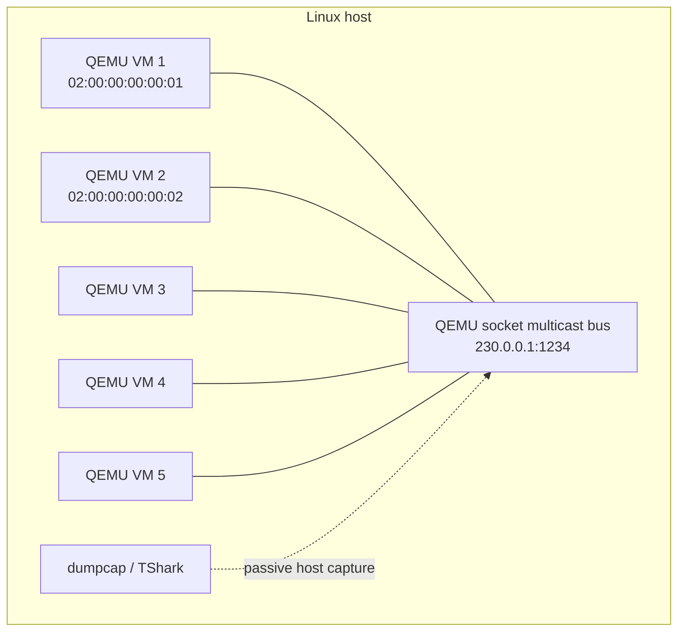
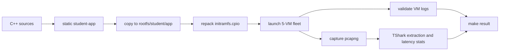

# Practical Class 1 - Precompiled x86_64 RT Linux, QEMU Networking, and TShark

This is the main student path for Practical Class 1. It starts from the supplied x86_64 image, so students do **not** compile Linux or BusyBox during the class.

Before beginning, read both base resources:

- Ilton's *Minimal RT Linux Setup Tutorial*, to understand the kernel + initramfs boot model;
- `INE5424 - Projeto 2026-2.pdf`, especially the global requirements and Stage 1.

The practical has four checkpoints:

1. Boot a minimal x86_64 Linux 6.15.5 kernel and prove that it is `PREEMPT_RT`.
2. Compile a static application, place it in the initramfs, and run it automatically from `/init`.
3. Connect at least five QEMU VMs and implement raw Ethernet broadcast communication without guest IP.
4. Capture the virtual-network traffic externally and derive repeatable latency statistics with TShark.

The raw-socket program, five-VM launcher, packet-decoding filter, and statistics script are student work. This guide gives the environment, constraints, checks, and useful starting points, but intentionally does not provide those complete solutions.

## 1. What is supplied

The instructor archive is:

```text
INE5424-x86_64-starter-6.15.5.tar.gz
```

Its SHA-256 is:

```text
624b80de99f57361cd3ce97e3c769ffaab41938ec6987923584bdd17f8f0d831
```

The archive contains:

```text
INE5424-x86_64-starter-6.15.5/
├── bzImage                 precompiled Linux 6.15.5 x86_64 kernel
├── kernel.config           exact kernel configuration
├── initramfs.cpio          ready-to-boot minimal root filesystem
├── rootfs/                 editable unpacked initramfs tree
│   ├── init                first userspace process
│   ├── bin/busybox         static BusyBox
│   └── student/app         initial static Hello World
├── run-vm.sh               one-VM QEMU launcher
├── install-app.sh          installs an executable and repacks the initramfs
├── repack-initramfs.sh     repacks rootfs manually
├── hello.c / hello         initial smoke-test source and executable
├── README-FIRST.md
├── BUILDINFO.txt
└── SHA256SUMS
```

The kernel is the already validated x86 counterpart of the tutorial environment:

- Linux 6.15.5;
- `CONFIG_PREEMPT_RT=y`, not `PREEMPT_DYNAMIC`;
- `CONFIG_EXPERT=y`, required by this configuration to expose/select RT preemption correctly;
- packet sockets, VirtIO networking, initramfs, devtmpfs, serial console, System V IPC, POSIX timers, and loadable modules enabled;
- approximately 12 MiB compressed kernel, 3.4 MiB initramfs, and 128 MiB VM RAM.

It is still a minimal system: there is no distribution, systemd, package manager, desktop, GRUB, or virtual disk.

## 2. Architecture



QEMU carries complete guest Ethernet frames inside host UDP multicast datagrams. The host transport is an implementation detail; the project application in each guest sends and receives raw Ethernet frames and does not use guest IP.

```text
Host packet:  [host Ethernet/IP/UDP] [QEMU payload........................]
Guest frame:                         [dst MAC][src MAC][type][app payload]
                                          6 B      6 B     2 B
```

## 3. Prepare the Linux host

These commands target Ubuntu or Debian. Work in a new directory so no host configuration or previous project is overwritten.

```bash
sudo apt-get update
sudo apt-get install -y \
  build-essential g++ qemu-system-x86 cpio file tmux \
  tshark wireshark-common

mkdir -p ~/ine5424-class1
cd ~/ine5424-class1
```

Copy or download the two instructor files into that directory:

```text
INE5424-x86_64-starter-6.15.5.tar.gz
INE5424-x86_64-starter-6.15.5.tar.gz.sha256
```

For example, from another machine:

```bash
scp INE5424-x86_64-starter-6.15.5.tar.gz* USER@LINUX_HOST:~/ine5424-class1/
```

Verify before extracting:

```bash
cd ~/ine5424-class1
sha256sum -c INE5424-x86_64-starter-6.15.5.tar.gz.sha256
tar -xzf INE5424-x86_64-starter-6.15.5.tar.gz
cd INE5424-x86_64-starter-6.15.5
sha256sum -c SHA256SUMS
```

Both checks must report `OK`. Do not continue with a damaged archive.

Verify the host tools:

```bash
qemu-system-x86_64 --version | head -1
g++ --version | head -1
tshark --version | head -1
```

## 4. Inspect and boot the supplied VM

First inspect what will be booted:

```bash
file bzImage initramfs.cpio rootfs/bin/busybox rootfs/student/app
grep -E '^(CONFIG_EXPERT|CONFIG_PREEMPT_RT|CONFIG_PREEMPT_DYNAMIC|CONFIG_PACKET|CONFIG_VIRTIO_NET|CONFIG_MODULES)=' kernel.config
du -h bzImage initramfs.cpio
sed -n '1,200p' run-vm.sh
sed -n '1,200p' rootfs/init
```

The important configuration result is:

```text
CONFIG_EXPERT=y
CONFIG_PREEMPT_RT=y
CONFIG_PACKET=y
CONFIG_VIRTIO_NET=y
CONFIG_MODULES=y
```

Boot VM 1:

```bash
./run-vm.sh 1
```

Expected evidence includes:

```text
Linux ... 6.15.5 ... PREEMPT_RT ... x86_64
VM id: 1
eth0 ... 02:00:00:00:00:01
Hello from the precompiled INE5424 x86_64 VM!
SO2_VM_ID=1
```

Inside the VM, confirm it yourself:

```sh
uname -a
cat /proc/cmdline
ip link
cat /sys/class/net/eth0/address
```

Stop it cleanly:

```sh
poweroff -f
```

If the guest stops accepting input, QEMU's `-nographic` escape is `Ctrl-A`, then `X`.

### Why this does not show `PREEMPT_DYNAMIC`

`bzImage` already contains the kernel code and its final configuration. `kernel.config` documents that build; QEMU does not compile or reconfigure it. If `uname -a` shows `PREEMPT_DYNAMIC`, a different kernel image was booted. Check the current directory and the `-kernel bzImage` argument before rebuilding anything.

Do not run the tutorial's kernel `make` commands on this path. Those commands create a new kernel and are unrelated to the supplied binary unless you intentionally replace `bzImage`.

## 5. Compile and inject a student application

All executables placed in the initramfs must be built for x86_64 and linked statically. A dynamically linked executable will normally fail with a misleading `not found` because this rootfs has no dynamic loader or shared libraries.

Create a project area outside the supplied rootfs:

```bash
mkdir -p student-src build
```

Start with a small C++ program that prints its VM identity. Read `SO2_VM_ID` with `std::getenv`, print a line, and return normally. Compile it with:

```bash
g++ -std=c++17 -O2 -Wall -Wextra -pedantic -pthread -static \
  -o build/student-app student-src/main.cpp
```

Verify the result before injection:

```bash
file build/student-app
ldd build/student-app || true
```

`file` must say `x86-64` and `statically linked`; `ldd` should say it is not a dynamic executable.

Install it as `/student/app` and rebuild the initramfs:

```bash
./install-app.sh build/student-app
```

Boot again:

```bash
./run-vm.sh 1
```

`/init` exports `SO2_VM_ID` and starts `/student/app` automatically. This lets one binary choose a deterministic test role based on the VM number.

## 6. Raw Ethernet exercise

Stage 1 requires a minimal C++ communication API whose lowest `Engine` transfers Ethernet frames through raw sockets. The test must use at least five QEMU VMs, each representing a vehicle, on a private virtual network.

### Required behavior

Your first implementation must:

- open an `AF_PACKET` raw socket on `eth0`;
- send complete Ethernet frames, without IPv4 or IPv6;
- always use destination MAC `ff:ff:ff:ff:ff:ff`;
- obtain and use the actual source MAC of `eth0`;
- choose a dedicated experimental EtherType consistently;
- keep every message below the Ethernet MTU so fragmentation is unnecessary;
- receive asynchronously or in a dedicated receive thread and propagate received data upward;
- expose the raw-socket details through an `Engine` abstraction instead of spreading system calls through the future `NIC`, protocol, and communicator layers.

For this first checkpoint, the payload may still be a simple byte array, exactly as Stage 1 specifies.

### System-call pointers, not an implementation

Research the Linux interfaces represented by these names:

```text
socket(AF_PACKET, SOCK_RAW, ...)
if_nametoindex or SIOCGIFINDEX
SIOCGIFHWADDR
sockaddr_ll
bind
sendto
recvfrom
htons
```

Useful headers include:

```text
sys/socket.h
sys/ioctl.h
net/if.h
netpacket/packet.h
net/ethernet.h
arpa/inet.h
```

Design the frame deliberately:

```text
byte 0                                                byte N
+----------------+----------------+----------+----------------+
| destination    | source         | EtherType| payload        |
| ff:ff:ff:...   | VM's eth0 MAC  | 2 bytes  | <= MTU-header  |
+----------------+----------------+----------+----------------+
       6 B              6 B           2 B
```

Questions your group should answer before coding:

1. Which values are stored in network byte order?
2. How will a receiver reject unrelated EtherTypes or malformed lengths?
3. How will a blocked receiver terminate cleanly during automated tests?
4. Who owns a received buffer, and when is it released?
5. How will the `Engine` notify the next layer without introducing a rendezvous protocol?

Compile the implementation statically and inject it using the same commands from Section 5.

## 7. Understand the QEMU private network

Before changing the launcher, read QEMU's documentation for `-netdev socket`, especially the `mcast=` form. QEMU describes VMs using the same multicast address and port as sharing an emulated bus:

- <https://www.qemu.org/docs/master/system/qemu-manpage.html>
- <https://www.qemu.org/docs/master/system/devices/net.html>

Then inspect the final lines of `run-vm.sh` and identify:

- the guest NIC model;
- the host network backend;
- the shared bus address;
- how a unique VM MAC is generated;
- which parts are guest-visible and which exist only on the host.

The supplied launcher uses this network contract:

```text
all VMs:  same mcast address and UDP port
each VM:  unique QEMU NIC MAC derived from VM id
guest:    eth0 up, no IP address required
host:     no TAP, bridge, route, or host-interface reconfiguration
```

You may select another administratively scoped multicast address or unoccupied UDP port for your group. Keep it configurable so parallel groups do not accidentally share a bus.

### Two-VM development test

Open two terminals, or use tmux:

```bash
tmux new-session -s so2
```

In one pane:

```bash
./run-vm.sh 1
```

Create another pane with `Ctrl-B`, then `%`, and run:

```bash
./run-vm.sh 2
```

Arrange for one VM to send and the other to receive. Prove from the receiver's output that:

- the destination is broadcast;
- the source is VM 1's MAC, not a hard-coded zero address;
- the EtherType is yours;
- the payload is intact;
- no guest IP address or IP socket was used.

### Five-VM test

Stage 1 requires at least five vehicles, so a two-VM demonstration is not sufficient. Create your own fleet script or test harness.

A robust test sequence should conceptually do this:

```text
choose one isolated multicast bus
start VM 2..VM 5 as receivers
wait until all receivers report READY
start or trigger VM 1 as sender
send a uniquely identifiable broadcast frame
wait with a finite timeout
assert that VM 2..VM 5 each received exactly the expected frame
stop all QEMU processes and return nonzero if any assertion failed
```

Do not use a fixed sleep as your only readiness mechanism in the final test. A readiness marker in each serial log, a control FIFO, or another explicit synchronization method is more reliable.

Keep each QEMU serial log. They are test evidence, but avoid using excessive guest logging while measuring latency because console I/O changes timing.

## 8. Passive capture with dumpcap and TShark

The monitor must run on the host, outside all VMs. This is non-intrusive with respect to the guest applications: it observes QEMU's multicast transport without adding a sniffer process inside a vehicle.

Allow the restricted capture helper to capture without running the full analyzer as root:

```bash
sudo setcap cap_net_raw,cap_net_admin+eip "$(command -v dumpcap)"
getcap "$(command -v dumpcap)"
dumpcap -D
```

Expected capabilities:

```text
cap_net_admin,cap_net_raw=eip
```

Use `any`, not only `lo`: the host may route multicast through a physical interface even though all QEMU processes are on one machine.

Start a bounded capture before the fleet test:

```bash
mkdir -p captures
timeout --signal=INT 40 \
  dumpcap -q -i any -f 'udp port 1234' -w captures/fleet.pcapng &
CAPTURE_PID=$!
```

Run the fleet test, then wait for or stop the capture cleanly:

```bash
wait "$CAPTURE_PID" || true
capinfos captures/fleet.pcapng
```

The capture filter above selects the **outer host UDP transport**. Your assignment is to discover how TShark exposes the UDP payload and to identify the embedded guest Ethernet header.

Useful exploration commands are:

```bash
tshark -r captures/fleet.pcapng -V | less
tshark -r captures/fleet.pcapng -T fields -e frame.number -e frame.time_epoch -e udp.srcport -e udp.dstport | head
tshark -G fields | grep -E 'Data|data\.data|udp\.payload' | head -30
```

Build and document a display filter or extraction procedure that proves all of the following from the capture alone:

- destination bytes are `ff:ff:ff:ff:ff:ff`;
- source bytes match the sending VM's configured MAC;
- the next two bytes contain your EtherType in network order;
- the remaining bytes contain your expected message and sequence identifier.

Do not confuse QEMU's outer host IP/UDP addresses with addresses in your guest protocol.

### Latency statistics

TShark can timestamp both directions at one host clock. That avoids comparing unsynchronized guest clocks, which is especially important before the project's temporal-synchronization stage.

Design a benchmark exchange with:

- a request kind and a response kind;
- a sequence number shared by the pair;
- minimal console output during the measured interval;
- multiple warm-up samples excluded from the result;
- enough measured samples to calculate at least count, mean, minimum, maximum, and preferably a percentile.

Have TShark export capture time plus the bytes needed to distinguish request, response, and sequence number. Write a small analysis program or script that pairs the frames and computes the deltas. Decide and state whether the reported value is request/response time or an inferred one-way estimate; do not label one as the other.

Important limitation: one outgoing multicast datagram visible on the host is not proof that every guest application processed it. Use the fleet assertions for correctness and the capture for transport evidence and timing. If the benchmark needs an observable completion event, define a broadcast response frame and capture that too.

## 9. Stage 1 acceptance checklist

Before considering Practical Class 1 complete, the repository should demonstrate:

- [ ] x86_64 Linux 6.15.5 boots and `uname -a` contains `PREEMPT_RT`;
- [ ] all student executables are static x86_64 binaries;
- [ ] at least five QEMU VMs model five vehicles;
- [ ] each VM has a unique Ethernet MAC;
- [ ] all VMs use one private virtual network;
- [ ] communication uses `AF_PACKET` raw sockets and complete Ethernet frames;
- [ ] guest IP is not used by the application protocol;
- [ ] every destination MAC is `ff:ff:ff:ff:ff:ff`;
- [ ] messages remain below MTU and are not fragmented;
- [ ] the raw-socket mechanism is confined to an `Engine` abstraction compatible with the specified API direction;
- [ ] reception can be propagated asynchronously toward the future `NIC`/Observer layers;
- [ ] four receivers prove reception of one sender's broadcast;
- [ ] an external capture independently proves frame layout;
- [ ] latency statistics are computed automatically and labeled correctly;
- [ ] documentation and diagrams are in `doc/`;
- [ ] running `make` from the repository root compiles and executes all evaluation tests.

## 10. Suggested repository automation

Once the manual path works, automate it. A useful repository shape is:

```text
project/
├── Makefile
├── src/
├── include/
├── tests/
├── scripts/
│   ├── install-initramfs.sh
│   ├── run-fleet.sh
│   └── analyze-capture.sh
├── vm/
│   └── x86_64-starter/       supplied VM artifacts or a documented fetch step
├── build/                    generated; do not commit large transient files
└── doc/
```

Aim for this dependency flow:



Suggested targets:

```text
make app        compile the C++ application statically
make image      install it and repack the initramfs
make fleet      launch the five isolated VMs with bounded timeouts
make capture    record the host-side QEMU traffic
make stats      extract and summarize the benchmark
make            run the complete reproducible evaluation path
make clean      remove only generated files under build/logs/captures
```

The supplied `/init` already runs `/student/app` and exports `SO2_VM_ID`. Your automation can therefore build one binary, inject it once, and launch the same image with different VM IDs. Each process can select its test role from that ID or from additional kernel-command-line parameters.

The root `make` target must fail when compilation fails, a VM times out, any expected receiver misses a frame, the capture is empty, or statistics cannot be calculated. A test that only prints warnings is difficult to evaluate reliably.

## 11. Scope boundary for later project stages

This starter is sufficient for Practical Class 1 and Stage 1. It also has `CONFIG_MODULES=y`, but the small student archive intentionally does not include the complete kernel build tree, generated headers, or `Module.symvers` needed to compile compatible external kernel modules.

For the later temporal and geographic-location stages, where the specification requires kernel modules, preserve this exact `kernel.config` and either:

1. distribute a matching kernel-module development kit from the same build; or
2. rebuild the kernel reproducibly and build every module against that exact output tree.

A module compiled against some other distribution kernel is not expected to load into this VM. Do not postpone that toolchain decision until the kernel-module stage.

## 12. Troubleshooting

### `uname` says `PREEMPT_DYNAMIC`

You booted a different `bzImage`. Return to the extracted starter, verify its archive checksum, inspect `run-vm.sh`, and confirm `CONFIG_PREEMPT_RT=y` in `kernel.config`.

### `/student/app: not found`, but the file exists

It is usually dynamic or built for the wrong architecture:

```bash
file rootfs/student/app
```

Recompile with the native x86_64 compiler and `-static`, then rerun `install-app.sh`.

### `socket(AF_PACKET, ...)` fails

Print `errno`. Inside this minimal VM, `/init` and the interactive shell run as root, so check the socket arguments, EtherType byte order, and whether `CONFIG_PACKET=y` before assuming a permission problem.

### VMs cannot see each other

Check that every launcher uses exactly the same multicast address and port, every `-netdev` ID matches its `-device ... netdev=` value, MAC addresses are unique, `eth0` is up, and receivers are ready before the sender transmits.

### Capture is empty

Check `dumpcap -D`, capabilities, the actual multicast port, and capture on `any`. Start capture before QEMU. Do not assume multicast is carried on `lo`.

### QEMU processes remain after a failed test

Record every child PID in the fleet script, use finite `timeout` values, install a shell `trap`, and terminate only the PIDs created by that test. Avoid broad commands such as `pkill qemu-system-x86_64` on a shared server.
